# 机协内训 week1

## 从零开始——智能循迹机器人的设计与制作

ZJUSRA Teaching_Department 方辰 赵楼晗

---

## 内训安排

- 主线任务

巡线小车 anycar 的搭建

- 支线任务

焊接、通信原理简介、pid 控制简介、电机驱动简介、机械设计基础简介、传感器简介……

---

# 看来我们学了很多内容了 是不是可以成为 机器人工程师了？ <!--fit-->

---

# TOO YOUNG TOO SIMPLE<!--fit-->

---

> **机器人工程师需要的技能数量是 IT 行业全栈工程师技能数量的三倍以上——YY 硕**

### 试想一个场景：完成无人小车的导航功能，需要多少技术栈？

---

## 硬件部分

- 什么样的机械结构设计

（二轮差速、阿克曼底盘、麦克纳姆轮……）
（solidworks、3D 打印……）
 

- 什么样的传感器

（怎样感知小车的运动？速度、加速度、角速度……）
（怎样感知小车的位置，怎么样感知周围的环境？视觉/激光雷达？）

---

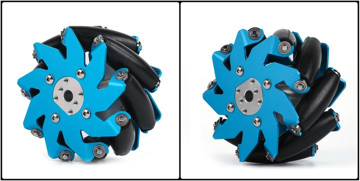

---

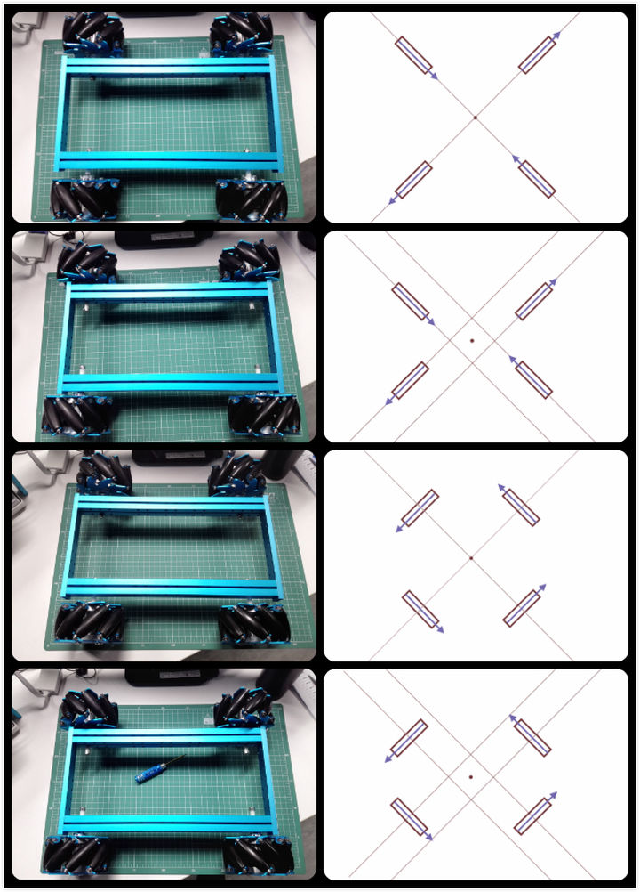

---

## 电路部分

- 选择什么样的开发板？（上位机、下位机）
- 怎样设计供电系统？

---

## 软件部分

- 通信

（电脑与机器人的通信：网线？ssh？路由设置？机器人之间的通信：串口通信？UART、SPI、I2C？多机器人：分布式、集中式？……）

- 算法（SLAM，同时定位与建图，怎样定位？amcl，自适应蒙特卡洛定位算法？怎样建图？cartography、gmapping？怎样路径规划？）

- 代码的基本框架

（基于 ros？自行搭建？什么操作系统？Linux？……）

- 数据结构

（地图信息用什么数据结构保存？数据库使用？）

---

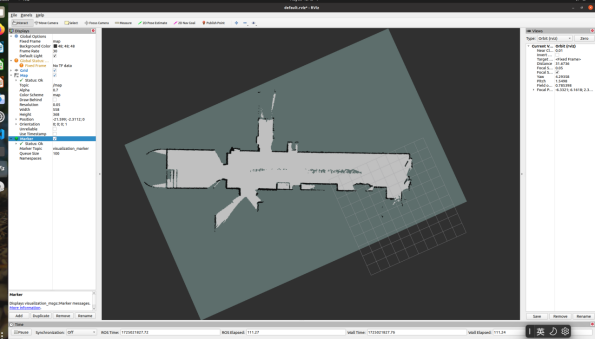
建图

---

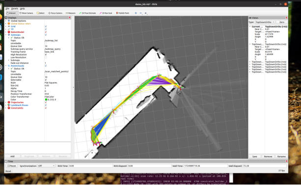
路径规划、导航

---

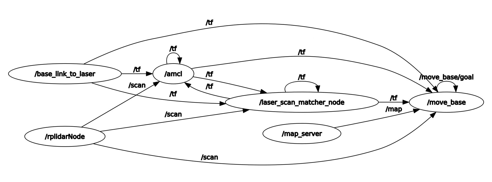
基于 ros 的程序框架 节点图

---

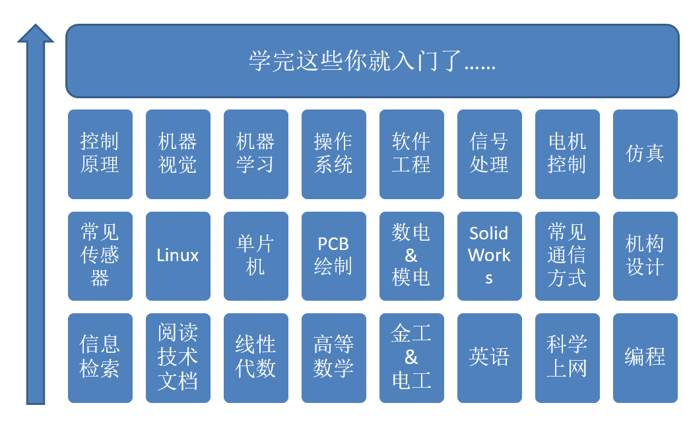

---

这还没完……

---

> 机器人学是一个艰苦的道路，想要成为一个独挡一面的机器人工程师需要多年理论和实践的同步训练。——YY 硕

---

# 千里之行，始于足下<!--fit-->

---

# 内训安排（秋冬学期）

| 周数  |        理论授课内容         |  实践授课内容 |
| ----- | :-------------------------: | ------------: |
| Week1 | 机器人简介和焊接的基础知识  |  焊接幸运转盘 |
| Week2 | 初识 arduino，速通 c 语言（ | Oled 和呼吸灯 |
| Week3 |         机器人架构          |      搭建小车 |
| Week4 | 直流电机、舵机、L298N 介绍  |  让小车动起来 |

---

| 周数  |     理论授课内容     |              实践授课内容 |
| ----- | :------------------: | ------------------------: |
| Week5 |     通信原理简介     | 实现 pc 和 arduino 的通信 |
| Week6 | 传感器与巡线原理介绍 |              编写巡线程序 |
| Week7 |     pid 控制介绍     |              巡线小车调参 |
| Week8 |          /           |         CASK 巡线小车比赛 |

- 课程约 8 次，每次约一个半小时
- 每次课分两个课时，一节理论课，一节实践课

---

# 所以什么是机器人<!--fit-->

---

## 先举几个栗子

譬如把大家骗进机协的机器狗（
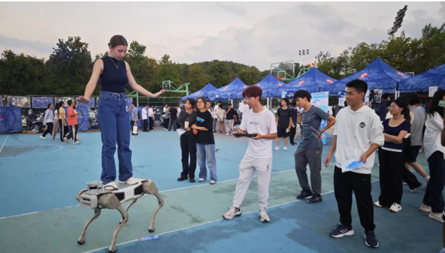 <!-- Setting size to 32x32 px -->

---

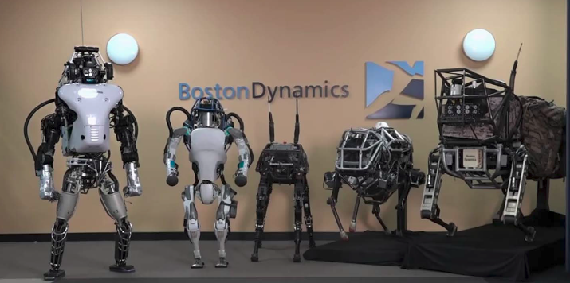

---

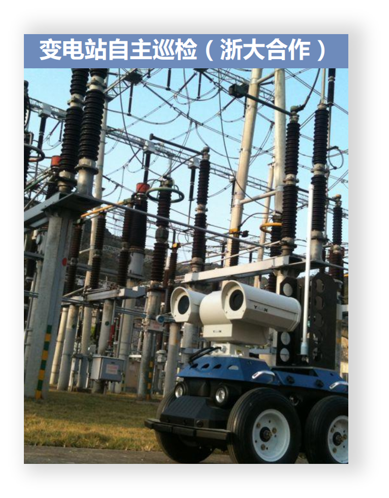
变电站自主巡检

---

# 那么什么不是机器人？ ——又到了无聊的定义环节

Wiki: There is much discussion about which machines qualify as robots, a typical robot will have several, though not necessarily all of the following properties:
•Is not “natural” i.e. has been artificially created.
•Can sense its environment.
•Can manipulate things in its environment.
•Has some degree of intelligence, or ability to make choices based on the environment, or automatic control / preprogrammed sequence.
•Is programmable.
•Can make dexterous coordinated movements.

---

# 简而言之，机器人就是机器+“人”

 

- 本质：人造的机器
- 功能：模拟人的样子或者功能

(当然模仿其他东西的也算广义的机器人)

---

我们既不是学数学的又不是学哲学的，我们为什么要研究机器人的定义？
 
机器人是一种人造的机器
机器人具有人类的特性
 
从机器人的定义中，我们可以知道机器人的终极研究目标：实现人类的特性

---

# 人类的特性

- 体能
- 智能

---

# 莫拉维克悖论

让计算机在智力测试或者下棋中展现出一个成年人的水平是相对容易的，但是要让计算机有如一岁小孩般的感知和行动能力却是相当困难甚至是不可能的。这便是在人工智能和机器人领域著名的莫拉维克悖论。

---

言归正传，我们从机器人的定义中知晓了机器人的终极目标：实现人类的特性。

而对人类的特性体能和智能的研究，构成了机器人研究的各个领域

---

# 体能

人类的**肌肉** 机器人的**驱动**
人类的**骨骼** 机器人的**机构**
人类的**运动** 机器人的**建模与控制**
人类的**感官** 机器人的**传感器**

---

# 人类的**肌肉** ： 机器人的**驱动**

- 电机驱动
- 液压驱动
- 气压驱动

思考：电机驱动和液压驱动的优缺点
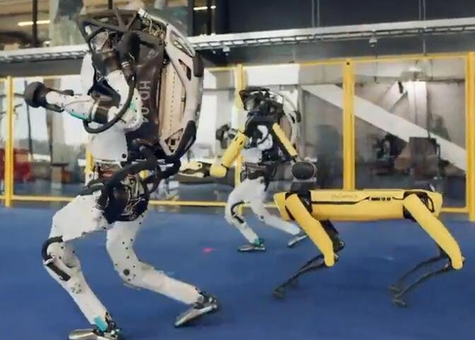

---

# 人类的**骨骼** 机器人的**机构**

以机械臂中的常用机构为例
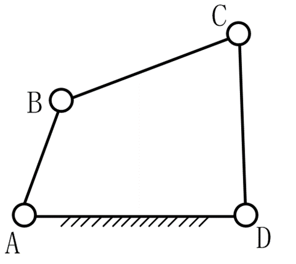
纳新题中的平面连杆结构

---

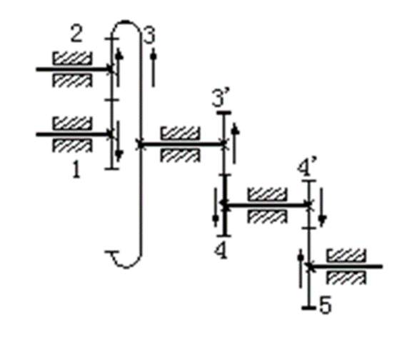
齿轮结构

---

# 人类的**运动** 机器人的**建模与控制**

## 移动机器人

- 阿克曼底盘
- 麦克纳姆轮
- 二轮差速底盘……

## 机械臂

- 正逆运动学

---

# 人类的**感官** 机器人的**传感器**

思考 1：一个无人机可能用到什么样的传感器？
思考 2：传感器原理举例

---

# 智能

## 机器人与人工智能交叉的方向

> 机器人学是在设计仿生人类躯干的机器，而人工智能学是在设计仿生人类意识的机器，两者当然可以结合起来，也必须结合起来

机器人的**知觉** **识别理解**

机器人的**作业** **决策规划**

机器人的**协作** **多智能体**

---

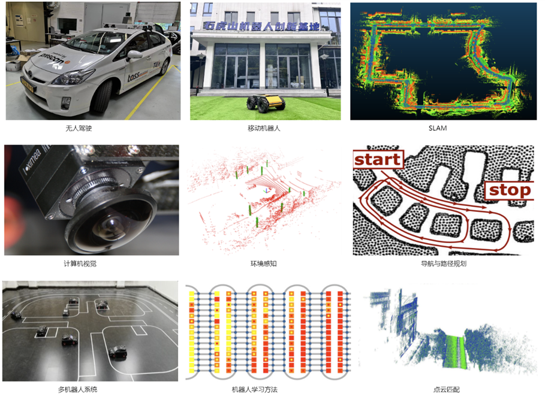

---

## 多智能体

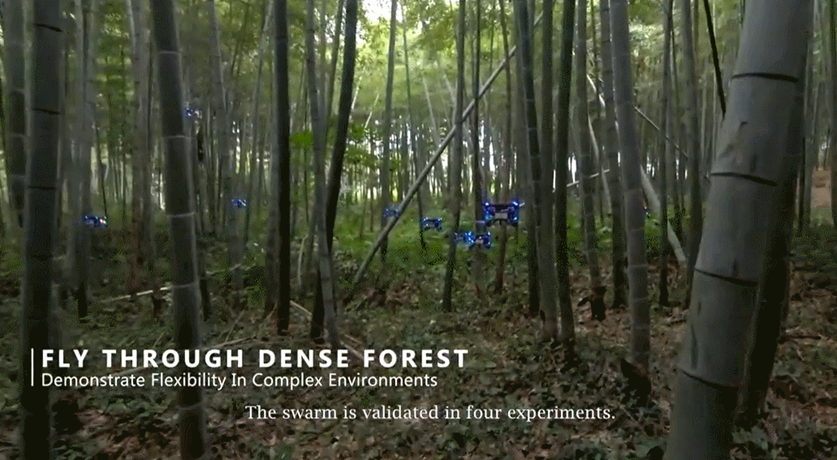

---

## 本校一些做机器人方向的老师

| 课题组： | 老师/研究方向 |
| -------- | :-----------: |

工控所 NESC 课题组：
李高峰老师：机械臂遥操作 | 李亮老师：无人驾驶、路径规划
李硕老师：最小最快的无人机 | 叶琦老师：3D 重建、VR……
FAST_LAB：|高飞老师：无人机集群
智控所：|熊蓉老师：人形机器人、人机协同……
朱秋国老师：机器狗|王酉老师：球形机器人
工智所：| 张宇 slam、路径规划

---

 
实践环节：

# 开焊<!--fit-->

---

# 安全<!--fit-->

---

## 遇到意外情况第一时间断电

## 不要触碰到金属部分

---

# 焊接小技巧（直插式）

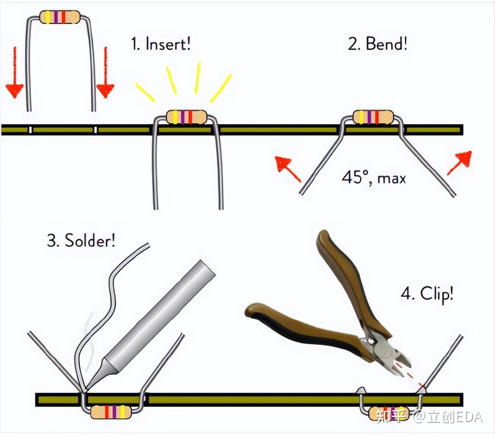
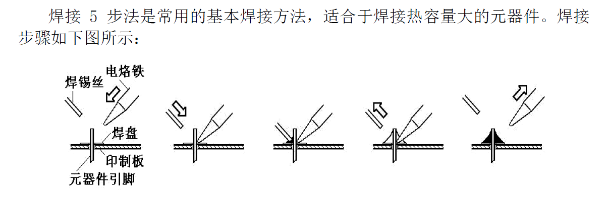

---

# 注意事项：

- 元件焊接顺序：从小到大、从低到高
- 注意元件的正负极：长脚为正（二极管、电容...）
- 剪去引脚过长的部分，防止短接而烧毁电路板
- 注意电阻的阻值
- 注意芯片的缺口朝向

---

# 关于电阻阻值

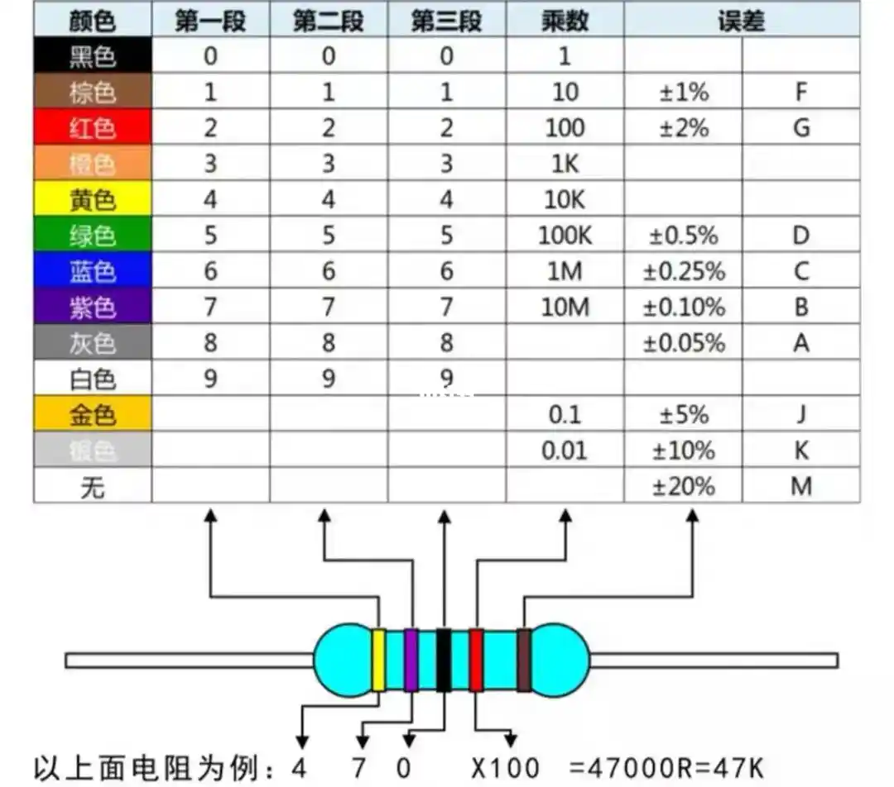

---

## 理想情况：

尾端会空开一段距离 间隙比头端的大

## 实际情况：

间隙难以区分

- 方法 1：
  看两端的颜色，排除法
  头端：一般电阻阻值是以 1,4,5 开头的（比如 1k，47k，51k……）
  尾端：误差不会太高

- 方法 2（非常好）：
  用万用表测
