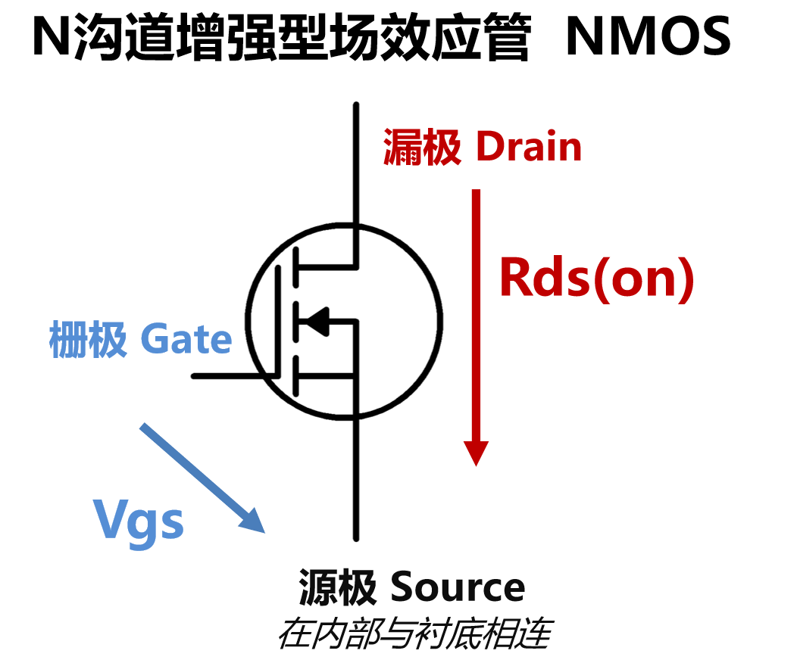
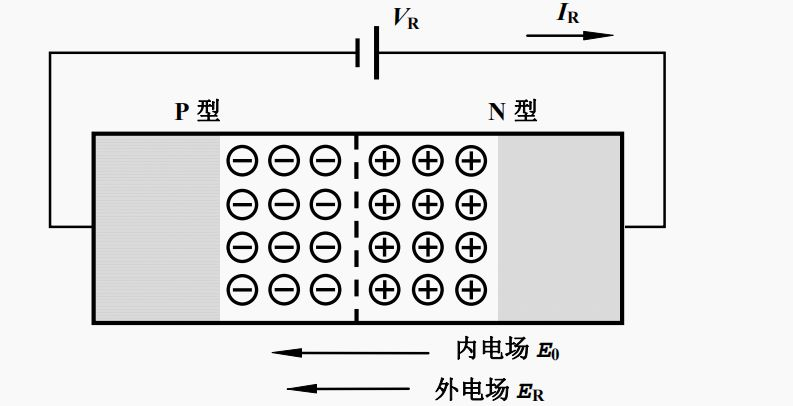
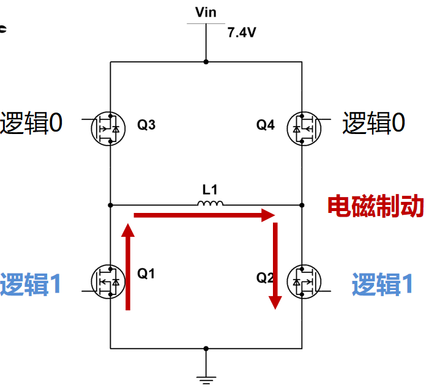
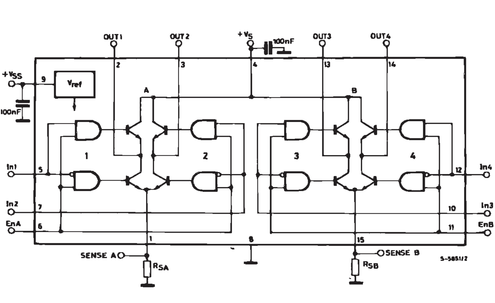
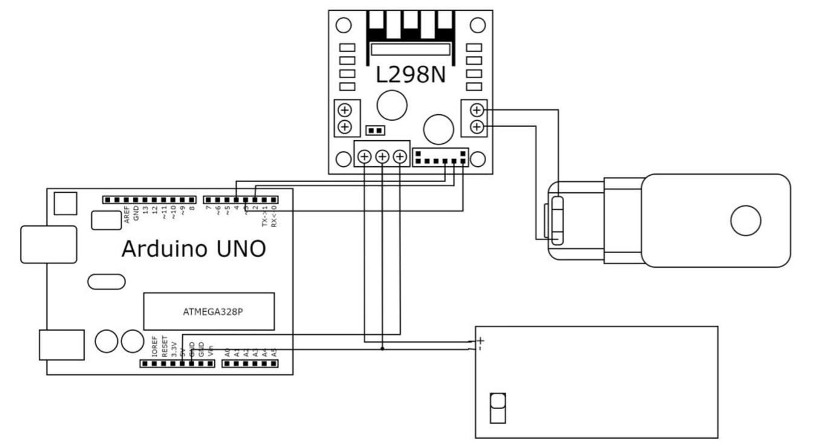
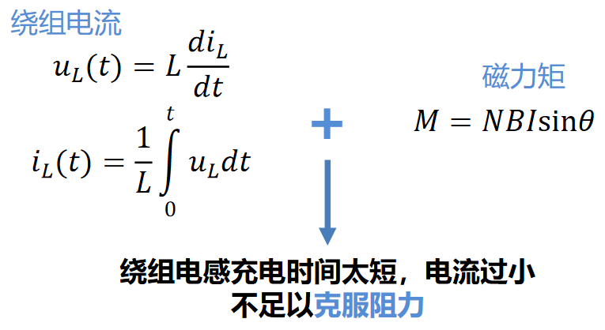
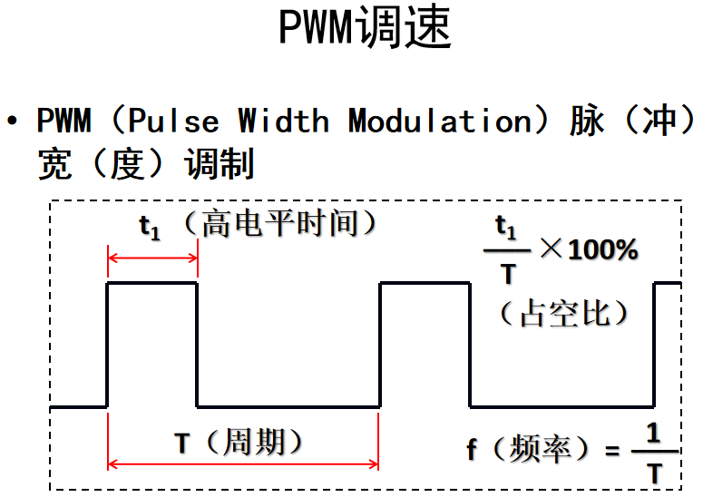

# 电机驱动原理

---

---

---

# 直流电机的正反转

---

---
# 拓展：PN结、二极管、BJT和FET
- PN结：半导体、微电子器件的基础
- 二极管：简单的PN结应用器件 单向导通
- 三极管（BJT）：双极型二极管；分为NPN、PNP；可起开关作用
- 场效应管（FET）：集成电路的核心器件；原理、应用都类似三极管

---
# PN结与二极管

---

---

---

---

---
# 电机驱动——L298N

---

---

---

---

---

---

---

---
