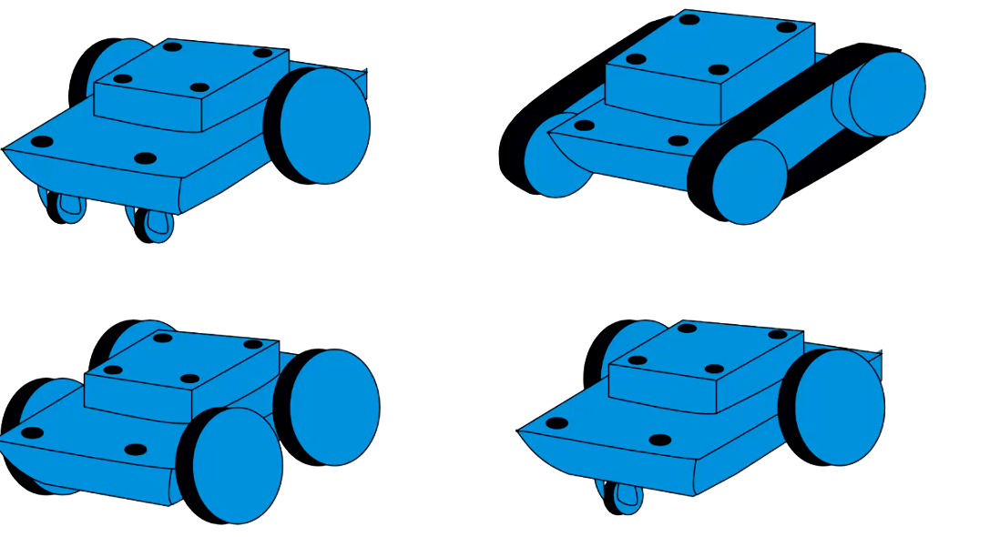
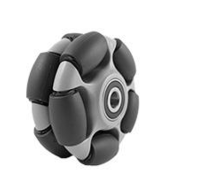
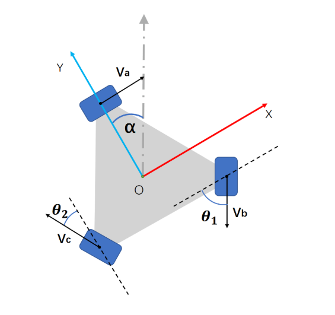
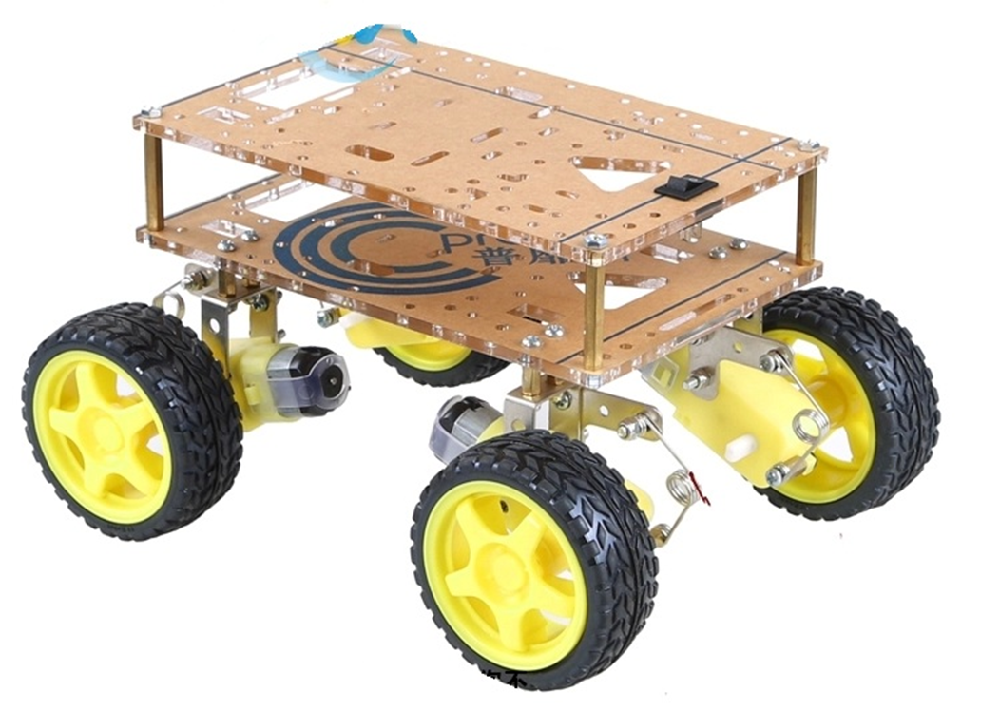
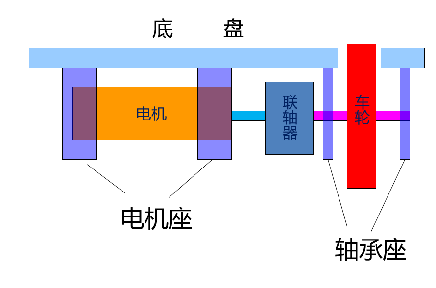

# 机器人架构（机械设计）
（本文参考了王浩老师中控杯培训ppt机械部分）

---
# 机器人底盘设计
- 双轮差动式底盘

- 问题：辅助轮的多少影响了什么？各有什么优缺点？

---
# 全向底盘
- 麦克纳姆轮Mecanum Wheel
（大轮子周围还有一圈小轮子，小轮子斜45°安装）
- 全向轮Omni Wheel
（大轮子周围还有一圈小轮子，小轮子与大轮子垂直安装）

---
# 麦克纳姆轮

---

---
# 全向轮

---

[步兵车](步兵车.mp4)

---

---
# 支撑轮

---
# 底盘悬挂

---
# 下面是工训时间<!--fit-->
---
# 常用主材

- 亚克力板（直接找淘宝商家定做）
- 3D打印材料

---
# 常用加工方法
- 带锯机
- 钻床
- 铣床
- 车床
- 3D打印（可找代工）
- 线切割（可找代工）
- 激光切割（可找代工）
- 钳工

---
- 塑料板、木板、亚克力板（激光切割）
- 铝或其他金属、合金板（线切割）
- 打孔（钻床）
- 轴（车床）
- 复杂立体表面（铣床）
- 金属连接（电弧焊、锡焊）
- 木材切割（带锯机、锯木机）
- 小型的、强度要求不大的零部件（3D打印）
- 通用金属加工方法（钳工）

---
# 机械设计常见问题
- 轮子不接触地面
- 刹车和机件工作时剧烈抖动
- 工作时发出让人厌烦噪声
- 不走直线
- 变形
- 被撞飞

---
# 设计常常需要考虑的问题
- 考虑重心位置
- 考虑支撑平面
- 考虑保护
- 考虑材料

---
# 常用电机安装示意图

**思考**：联轴器作用？如果直接把车轮连在电机上会怎么样？

---
# 常用电机
- 直流减速电机
- 步进电机（脉冲控制）
- 舵机（不适合底盘，适合执行机构，固定到某个位置）
- 直流无刷电机（无人机，转速非常快，扭矩非常大）
