# C语言速成和Arduino基础

---

# What is Arduino ？

Arduino 是一个能够用来 感应 和 控制 现实物理
世界的一套工具。

Arduino 是一个基于单片机并且 开放 源码的硬
件平台，和一套为 Arduino 板编写程序的开发
环境（ 免费 ）组成。

Arduino 简化 了单片机工作的流程，同其它系
统相比， Arduino 在很多地方更具有优越性，
特别适合老师，学生和一些业余爱好者们使用

--- 

# Arduino名称由来

意大利北部一个如诗如画的小镇「Ivrea」，横跨过蓝绿色Dora Baltea河，它最著名的事迹是关于一位受压迫的国王。公元1002年，国王Arduin成为国家的统治者，不幸的是两年后即被德国亨利二世国王给废掉了。今日，在这位无法成为新国王的出生地，cobblestone街上有家叫「di Re Arduino」的酒吧纪念了这位国王。Massimo Banzi经常光临这家酒吧，而他将这个电子产品计划命名为Arduino以纪念这个地方。

---

# 单片机&嵌入式系统&微控制器

## 名词解释
- 单片机：直接理解为微控制器
- 微控制器(MCU)：基本计算机（为什么是计算机？因为 MCU 中使用的基本组件：CPU、系统时钟、内存，所有这些都是计算机使用的。什么样的计算机？完成单一功能的计算机）
- 嵌入式系统：以应用为中心、以计算机技术为基础、软件硬件可裁剪、适应应用系统对功能、可靠性、成本、体积、功耗严格要求的专用计算机系统（说人话：计算机技术“嵌入”到各种设备中，让这些设备变得更智能、更强大）

---

# 如果你分不清，就把它们认为是一类东西吧<!--fit-->

---
现代技术纷繁复杂，我们不可能研究每个问题都从最细节的地方着手。
就像我们研究平面几何，不可能都从欧几里得的几个公理、公设出发；研究微积分，不可能都从$\epsilon-\delta$语言出发；我们必然是建立在一层层的**抽象**之上。

**抽象**：抽象让我们忽略细节，在不同的层次上处理细节

# 我们关心的问题
对于机器人工程师，我们只去关心单片机上的程序怎么写，而不去关心单片机内部构造如何实现，这是电子工程师的事情。

---
# 这是我们不关心的问题（
>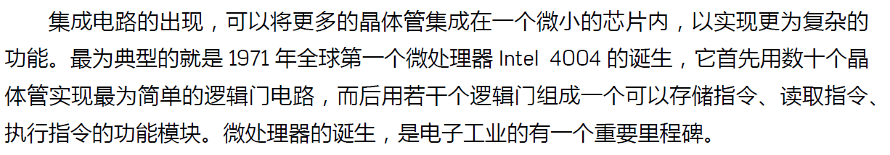

不过这在现代电子技术中是一段辉煌的历史，对历史感兴趣的同学可以搜索key words:八叛逆、仙童半导体……对这部分知识感兴趣的同学可以玩一款游戏《图灵完备Turing Complete》

---

# How does it work？

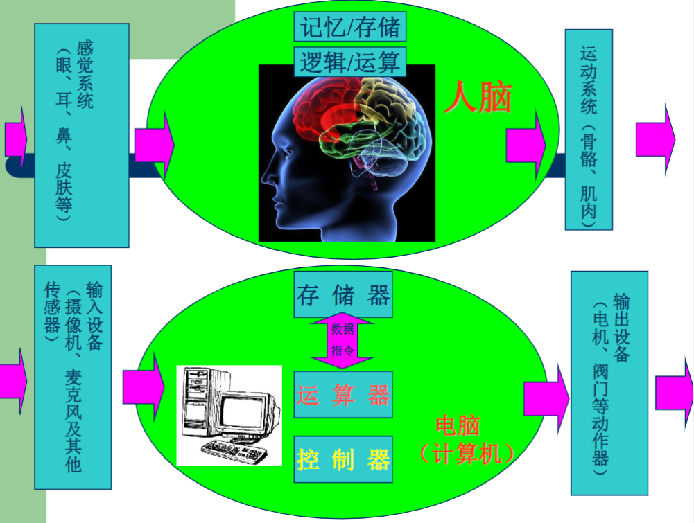

---
## 冯诺依曼结构
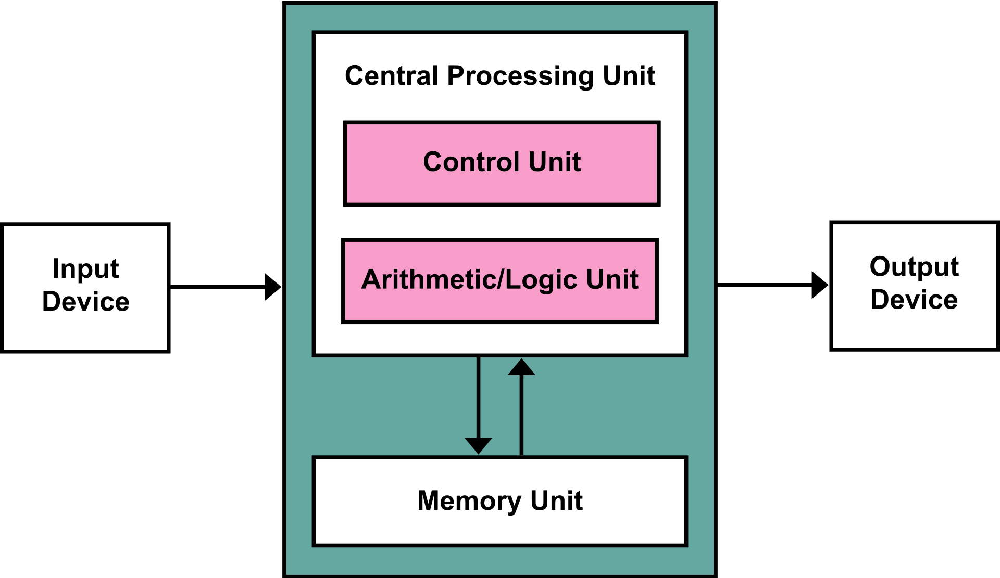

--- 
### 冯诺依曼结构的灵魂
- 回顾历史：早期的计算机程序是硬件化的，程序和数据是俩个截然不同的概念，数据放在存储器中，而程序作为控制器的一部分
- 冯诺依曼的横空出世，将最初的硬件化程序变为可编程、可存储编码，放在存储器中，随意使用。将程序编码为数据，然后与数据一同存放在存储器中，无论什么程序，最终都是会转换为数据的形式存储在存储器中，要执行相应的程序只需要从存储器中依次取出指令、执行（譬如exe文件就是二进制编码的文件，可以直接运行）

- 这种设计思想导致了硬件和软件的分离，即硬件设计和程序设计可以分开执行
- 存储程序控制原理

--- 
# How to use it？

## 硬件
- Arduino Uno：基础款，适合入门的同学学习使用
- Arduino Mega-2560：提供丰富的输入输出端口
- Arduino LilyPad：可穿戴的电路板，适合开发可穿戴创意设备
- Arduino Nano：微型电路板

## 软件

- ArduinoIDE

--- 
# 认识硬件

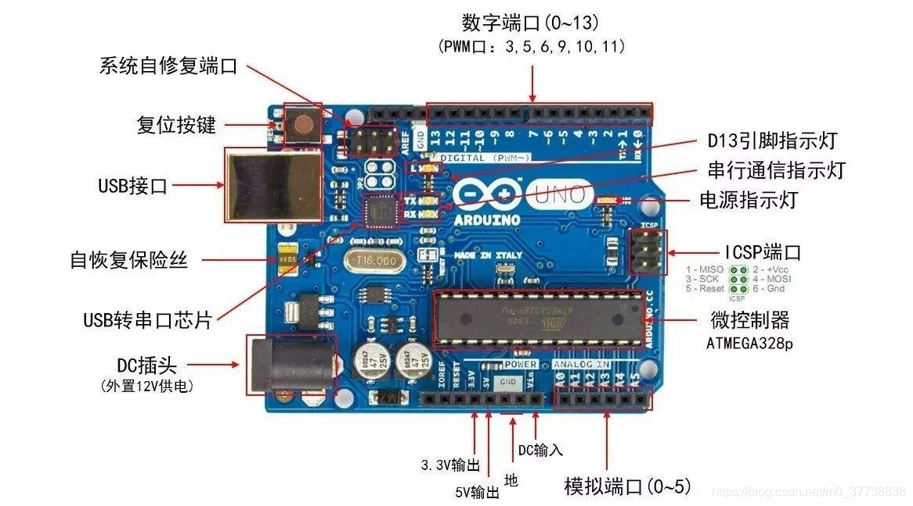

---
## key word
- USB接口
- 数字端口
- 模拟端口
- PWM
- 串行通信

---

# USB接口
USB（Universal Serial Bus），通用串行总线
- 初印象：U盘的接口
- 生活中常听到的说法：Type-C
 
两句话说明白：
- 按照大小分为：standard、mini、micro（标准、小型、微型）
- 按照形状分为：Type-A、Type-B、Type-C

---
# Type A
最常见的USB接口
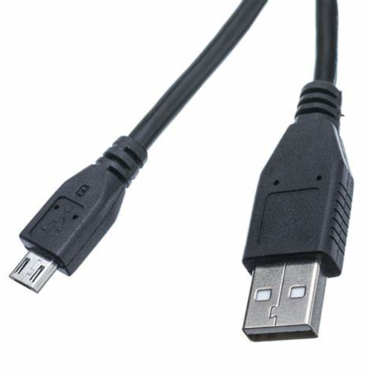

standard型号（mini、micro不常用）

--- 
# Type B
- 打印机中常用的接口
- arduino上的USB接口
- Type B standard型号
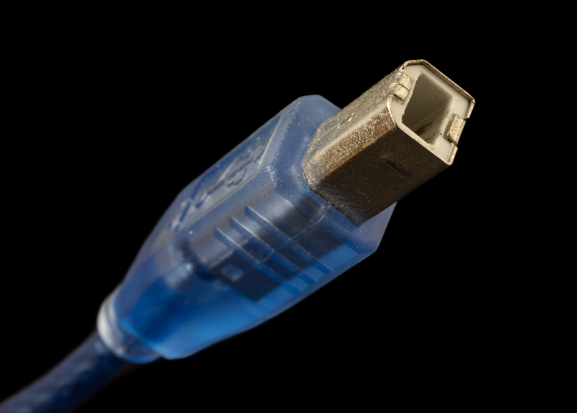
---
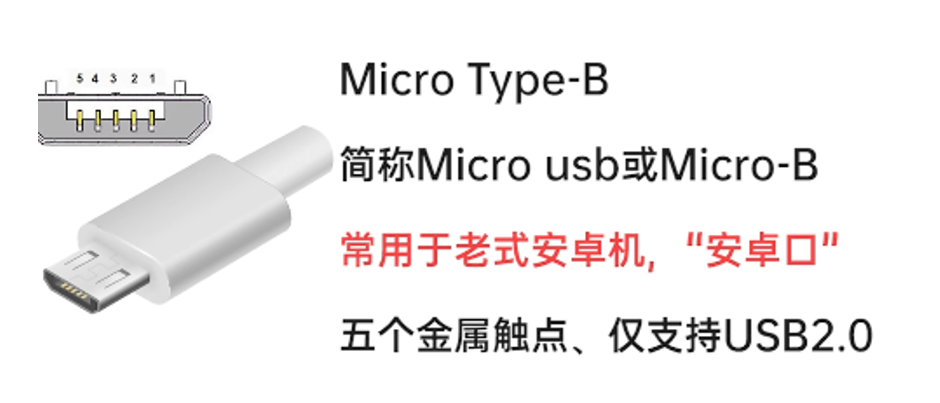
（顺带一提，micro-b已经用的很少了，如果大家有印象，就是当时智能手机出现之前，步步高、诺基亚这些手机使用的接口）

---
# Type C
- 现在大部分安卓手机使用的接口，已经逐步取代了micro-b
- 支持正反插
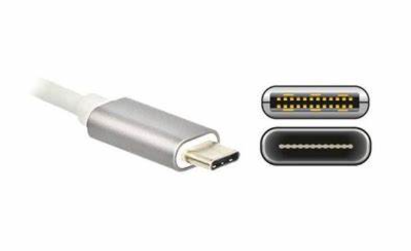

---
# 数字和模拟
- 模拟（analog）信号：在自然界中,我们可以感知的,在时间和幅值上都是连续的物理量称为模拟信号。
- 数字（digital）信号：数字信号是指在取值上是离散的、不连续的信号，只有有限个特定的电压值，表现为瞬时跳变直方形

---
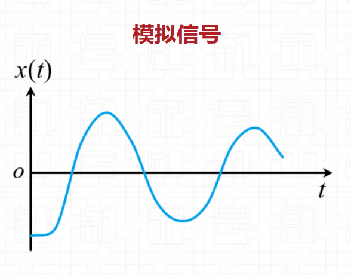

---
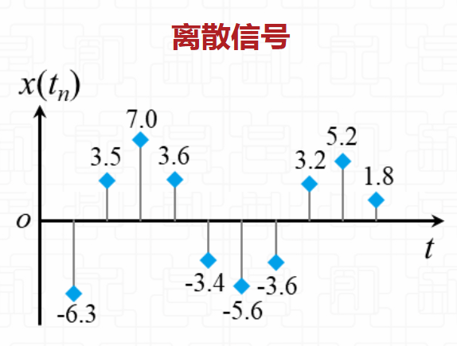

---
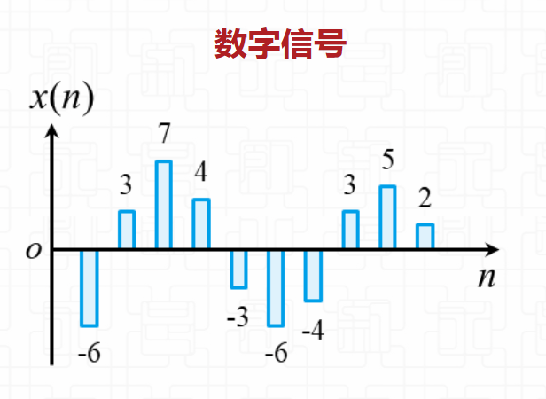

---
## 从模拟到数字
- 在电学中，用传感器将这样的物理量转变成为电信号，通常用连续变化的电压值或电流值表示。
- 采样：将时间上连续、幅度上也连续的模拟信号变换成时间上离散、但幅度上仍连续的已采样信号，采样完成模拟信号在时间上的离散化。
- 量化：用预先规定好了的有限个电平值来表示模拟抽样值，量化完成模拟信号在幅度上的离散化
- 编码：通常采用二进制编码，即用N 位二进制代码来表示量化值。

**思考**哪一步变成了模拟信号，哪一步变成了离散信号，哪一步变成了数字信号
**举例**唱片到数码文件

---
## 关于怎么采样、怎么量化、怎么编码
- 不展开讲，仅列出以下关键词
- 奈奎斯特采样定理
- 脉冲编码调制
- 模数转换
- 数字信号处理
- 低通滤波
- ……

---
# 软件

- 半小时速成C语言
- 认识arduino ide
- 示例实验

---

# 半小时速成C语言

- arduino语言建立在C/C++基础上
- 鉴于现在已经快到冬学期了，大家的C语言都已经讲了很多了
- 如果是学python的话，python和c语言的语法其实大同小异

---
# 基本框架
  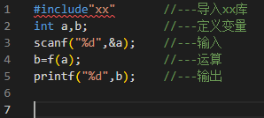
## 引用->输入->运算->输出
具体函数可以到实际用到时再学（）

---

# python与c语言的区别
大家都有Python基础（？），那就再梳理一下两者的一些主要区别：
1. C中语句需要在末尾加上分号“;”来表示一个语句的结束
2. 缩进在C中没有实际意义，在循环和判断结构以及函数定义中需要用大括号将语句块包起来
3. 定义时需要指明其类型，包括函数定义和变量定义，如：int x = 1;
 void f(int x,int y){printf(“%d+%d=%d”,x,y,x+y);}//void 是空类型，可以理解为没有类型，没有返回值
4. C程序需要一个入口函数main,但是在Arduino中这个入口函数被隐藏了，所以没有写也不用写
5. C中的数组类型与Python中的列表有相似处也有不同

---
# 学完了<!--fit-->
---
# 认识Arduino IDE

- 1、下载arduino ide
- 2、界面介绍
- 3、setup和loop
- 4、串口监视器
- 5、基本函数（analog/digital read/write）

---
# Arduino IDE
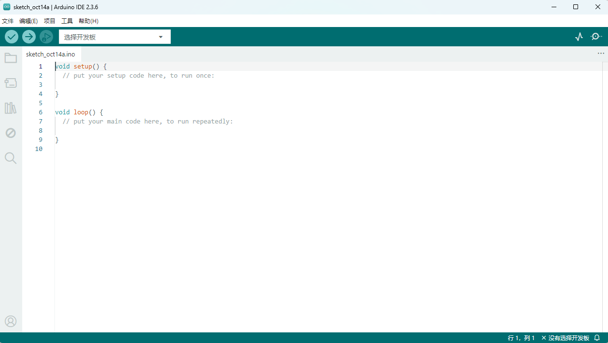

---
# 例程

- 1-hello arduino
- 2-让LED灯闪烁起来
- 3-控制灯的亮度（pwm、analog_write两种方法）
- 4-呼吸灯

---
# 1-hello arduino
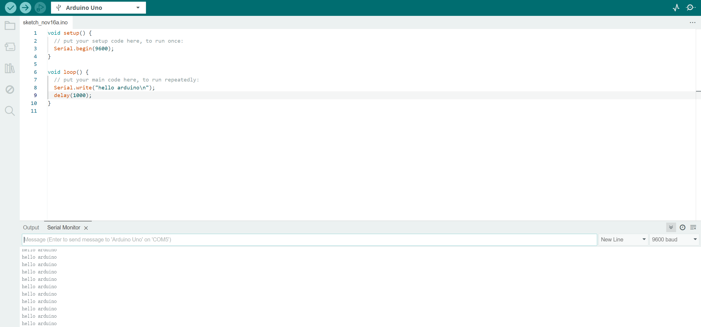

---
# 2-让LED灯闪烁起来
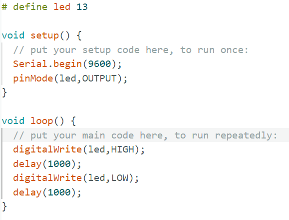
   

--- 
# 控制闪烁频率
- blink
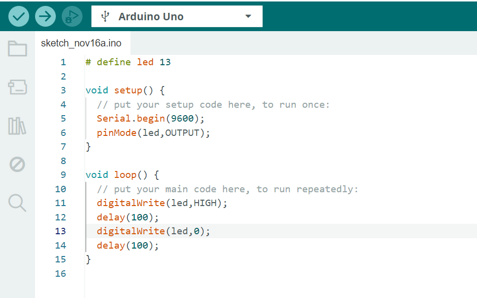
- 思考：当闪烁越来越快会发生什么

---
# PWM波

## Pulse Width Manipulate——脉宽调制

- 可以通过改变高电压在整个周期内的比重（也叫占空比）产生近似于连续变化的有效值。

- 可以用于连续调节（亮度、转速等）

---
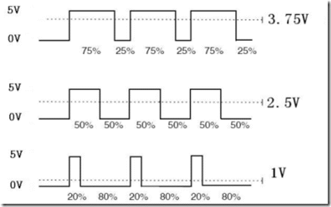

简而言之，pwm是一种用数字信号“模拟”模拟信号的过程

---
# 回到控制LED灯亮度
## 回顾之前讲到的模拟信号和数字信号
- Q：如何用digital_write控制输出亮度（电压）？
- A：使用PWM波
- Q：如何输出不同的亮度？
- A：改变PWM的占空比

---

# 3-控制LED亮度（PWM）
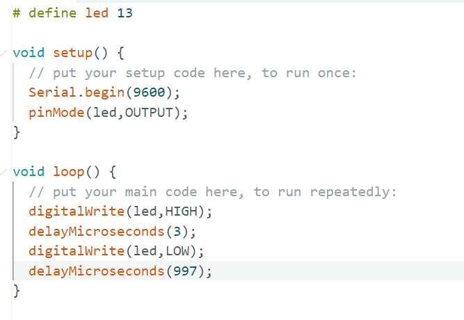

---
# 另一种方法
## arduino的模拟输出引脚（analog_write）
- 本质上仍是用pwm实现的，只不过将其“封装”成了一个函数
- 只有特定的标有“~”的引脚支持模拟输出功能！
- 板上自带led的13脚不支持模拟输出，故需更换引脚，外接led

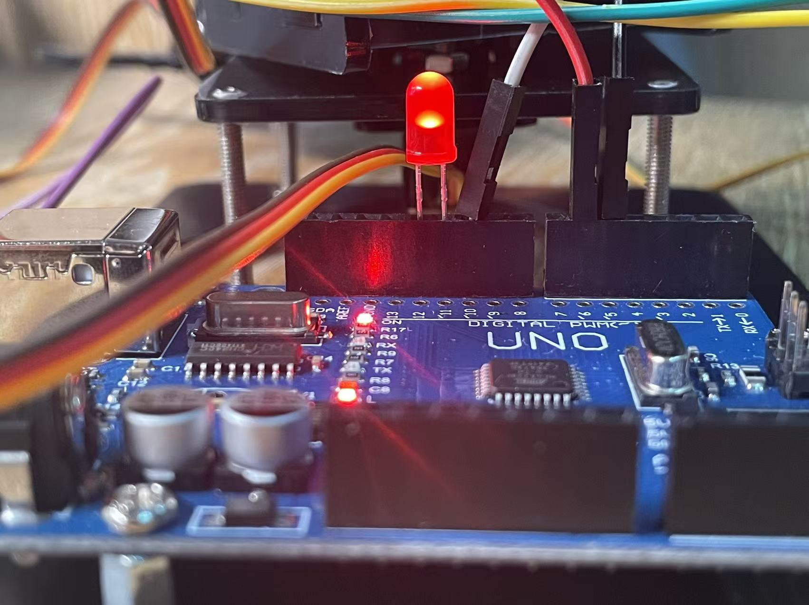

---
# 3-控制LED亮度（模拟输出）
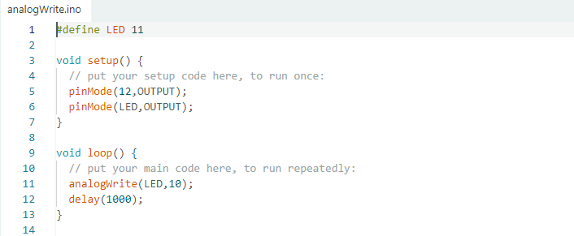

---
# 4-呼吸灯
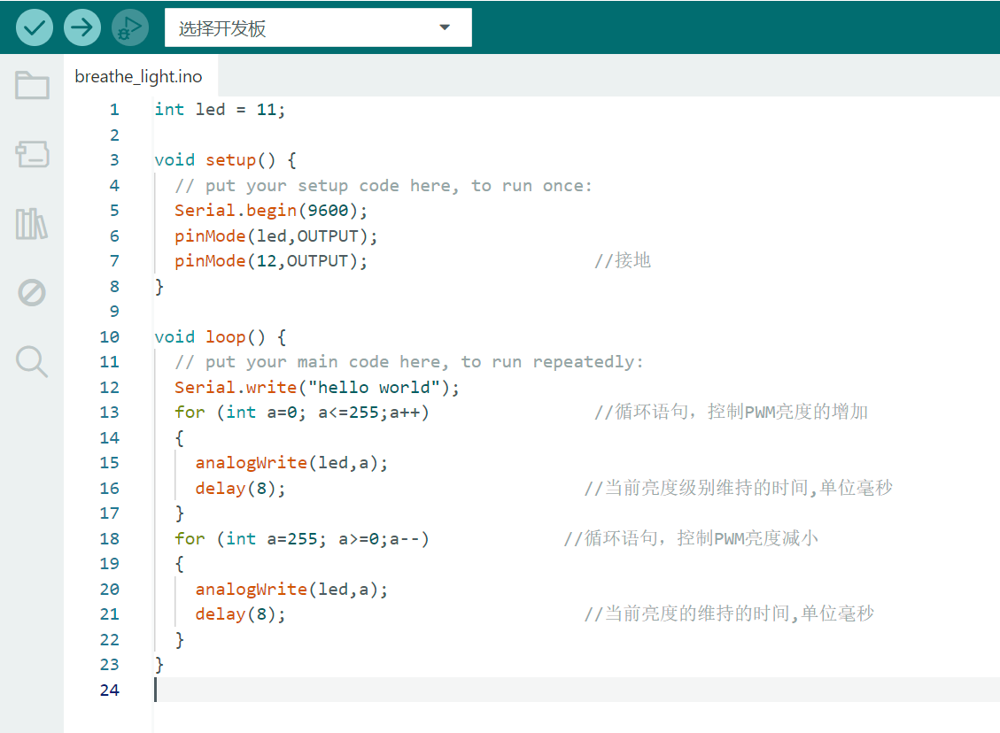

---
# BONUS
# 展现代码功底的时候到了：
# -如何不用analogWrite函数，手搓PWM实现呼吸灯？

---
# THANKS FOR YOUR ATTENTION!