# 电机驱动原理
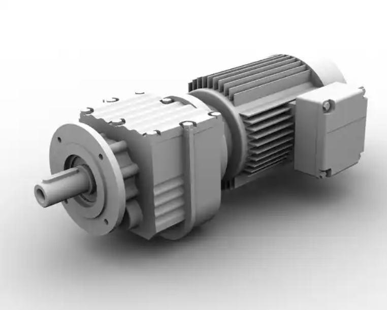

---
# 电机原理部分

---
# 常用电机
- 直流减速电机
- 步进电机（脉冲控制）
- 舵机（不适合底盘，适合执行机构，固定到某个位置）
- 直流无刷电机（无人机，转速非常快，扭矩非常大）

---

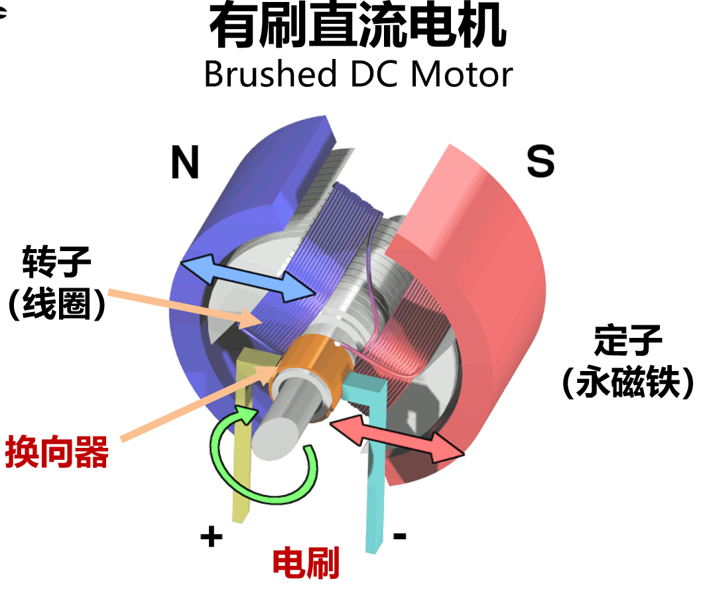

---
# 直流减速电机
- 普通电机+减速器
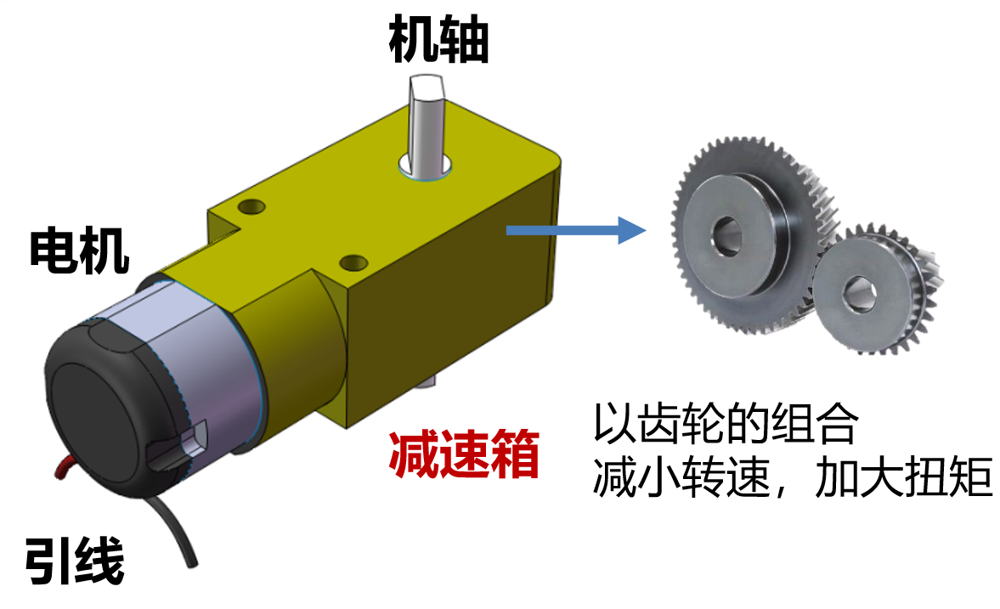
**思考**：减速器作用

---
## 如何选购电机？
**一些参数**
- 电压（如：12V、24V）
- 功率（如：5.6W、10W）
- 扭矩（如：N·m）
- 原电机转速（如：2000r/min）
- 减速比（如：500:1）

---
## 一个实际问题

**关注扭矩、转速**
考虑一只直流减速电机即可驱动车子，圆柱形橡胶车轮在平滑木板上的滚动摩擦系数为 0.05～0.07，取0.06；取车子重量为4千克，车轮半径为3.3cm，需要扭矩为：

$0.06\times4kg\times9.8m/s^2\times3.3cm=0.0776N·m$

---
# 力矩

**作用在刚体上某点P的力与该点至转轴的垂直距离d（力臂）的乘积**

$M=R\times F$

---
# 转速
取小车的行进速度分别为100厘米/秒，80厘米/秒，60厘米/秒，40厘米/秒时，则电动机转速分别为：
100厘米/秒*60秒/分/(3.14\*6.6厘米)=290转/分
80厘米/秒*60秒/分/(3.14\*6.6厘米)=232转/分
60厘米/秒*60秒/分/(3.14\*6.6厘米)=174转/分
40厘米/秒*60秒/分/(3.14\*6.6厘米)=116转/分

---
于是考虑选择37ZYJ-36ZY型直流减速电机，该电机性能数据如下：
减速比30/1，转速200转/分，扭矩2.5千克·厘米，额定电压为12V，空载电流 ≤350mA,负载电流 ≤1300 mA 。选用该类型的电机后，可以在大大满足扭矩要求的情况下，维持机器人的最大速度为70厘米/秒。

---
# 电机驱动部分

---

# 直流电机的正反转

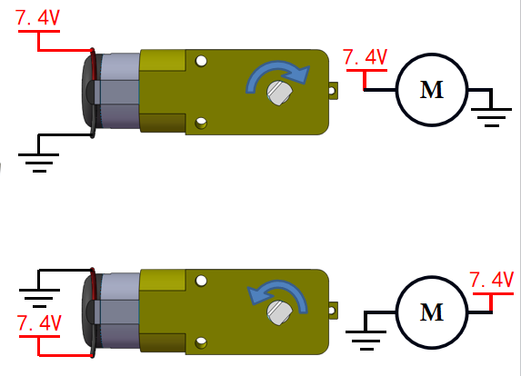

---
# Q:能不能不用手动改变外加电压的方向就改变电机的转向？

## A:加入电机驱动（H桥电路）

---

---
# 总而言之，你在这里可以先把它当成开关/电磁继电器/水龙头/whatsoever

---
# H桥电路

---

---
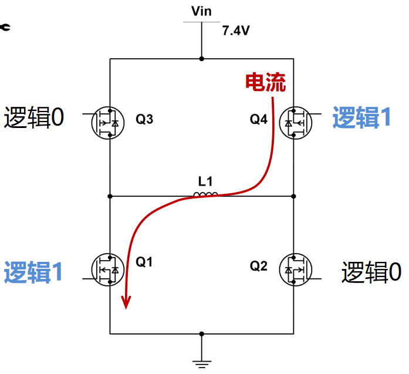

---

---

---
# 电机驱动——L298N

---

# What is L298N?
**电机驱动板**
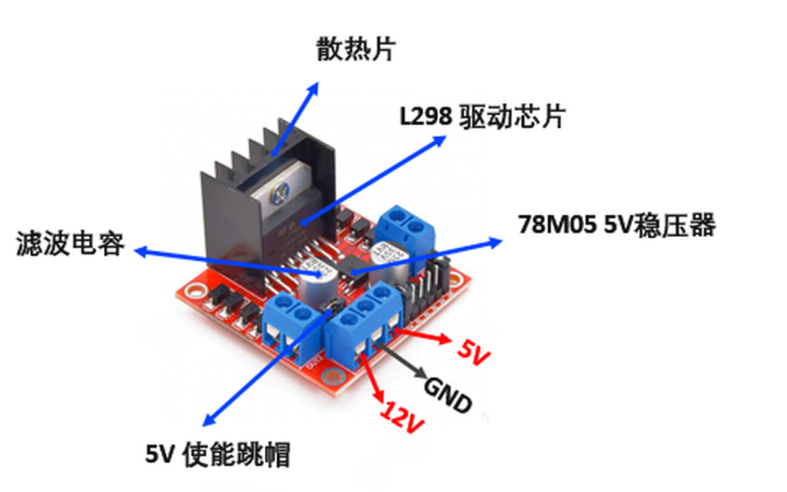

核心：
- L298N 驱动芯片：核心是两个H桥电路
- 78M05 稳压器：当电源小于或等于12V时，内部电路将由稳压器供电，并且5V引脚作为微控制器供电的输出引脚，即：VCC作为7805的输入，5V是7805的输出，从而可以为板载提供5v电压，为外部电路供电使用

---

---

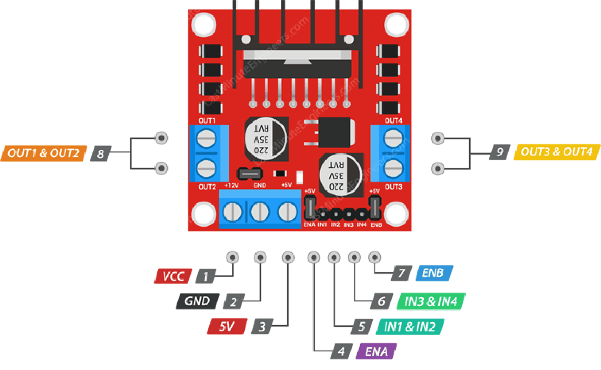

---

---
# Q:可以控制电机转向了，如何控制转速？
## A：调整使能端占空比

---

---
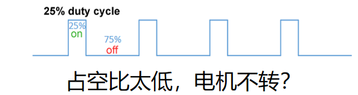

---

---

---
# 拓展：半导体器件

---
# PN结、二极管、BJT和FET
- PN结：半导体、微电子器件的基础
- 二极管：简单的PN结应用器件 单向导通
- 三极管（BJT）：双极型晶体管；分为NPN、PNP；可起开关作用
- 场效应管（FET）：集成电路的核心器件；原理、应用都类似三极管

---
# PN结与二极管
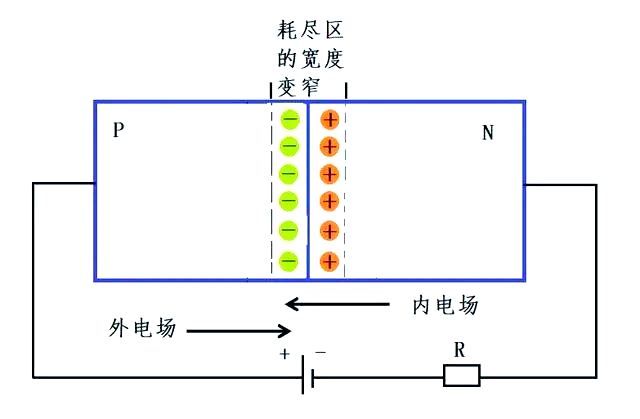

---
# 三极管
- 全称：双极型晶体管（Bipolar Junction Transistor）
- 分类：NPN、PNP
- 核心原理：像水龙头的阀门一样，控制流过的电流大小
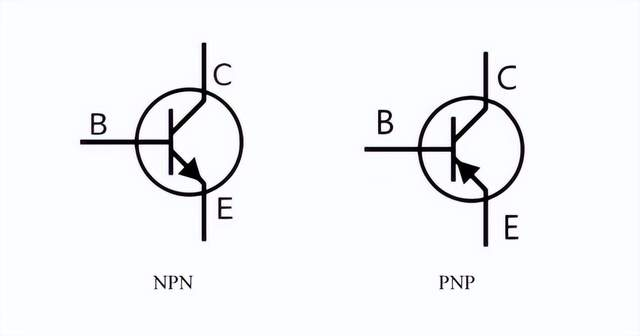
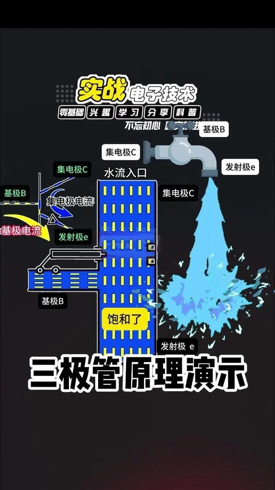

---
# 三极管原理
（本图借鉴了电子电路基础chap7的ppt）
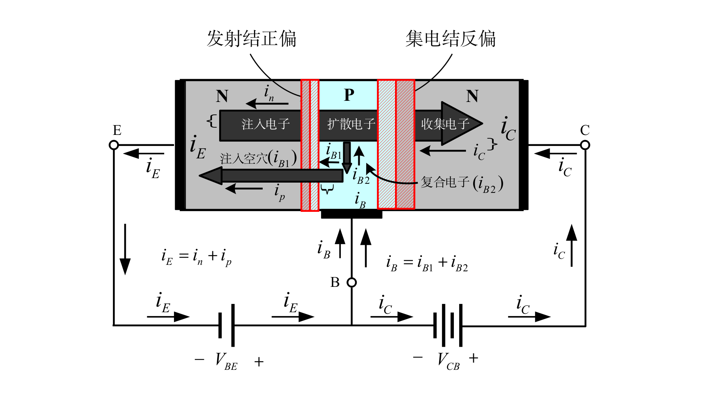

---
# 场效应管（Field Effect Transistor）
- 集成电路的核心器件；种类样式繁多（MOSFET、FinFET等）
- 以MOSFET为例，下分增强型/耗尽型 NMOS/PMOS
- NMOS可以看作NPN型三极管，PMOS可以看作PNP型三极管
- CMOS:互补型（complementary）金属氧化物晶体管

---
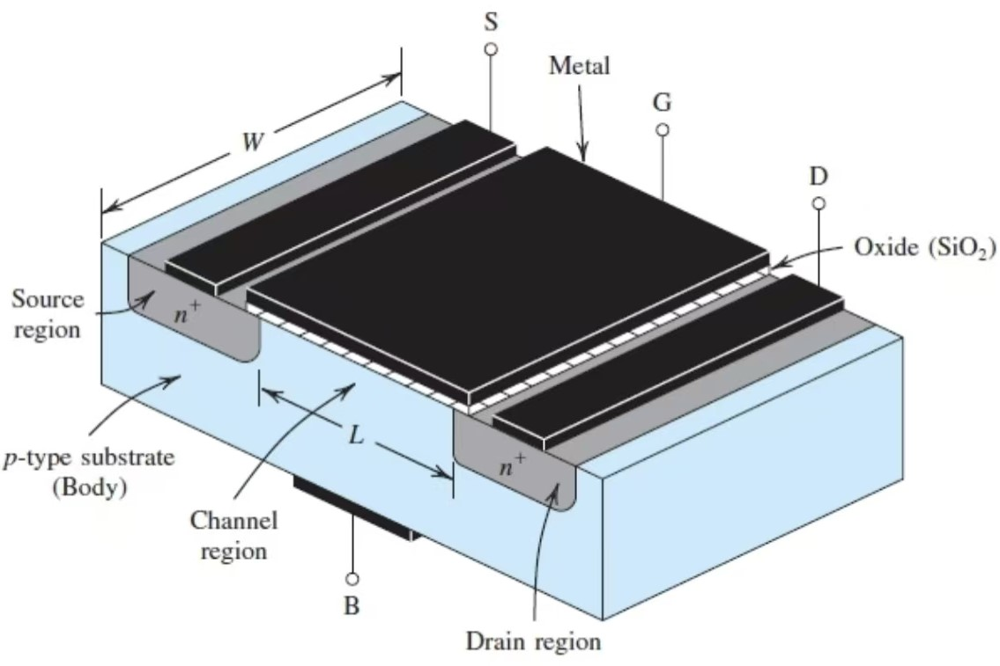
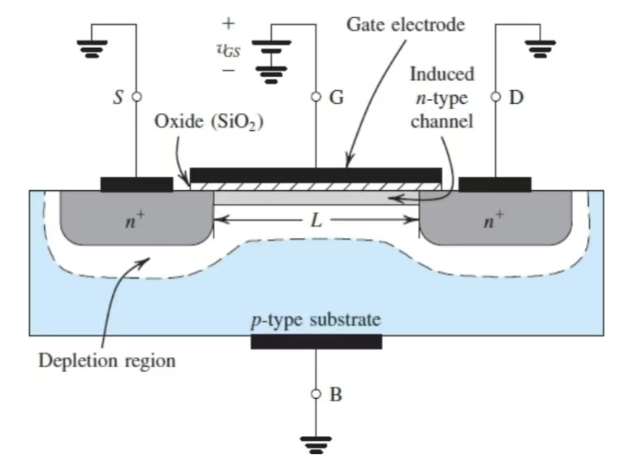

- 感兴趣可以自行搜索FinFET、GAA、摩尔定律等关键词

---
# THE END
# THANKS FOR YOUR ATTENTION