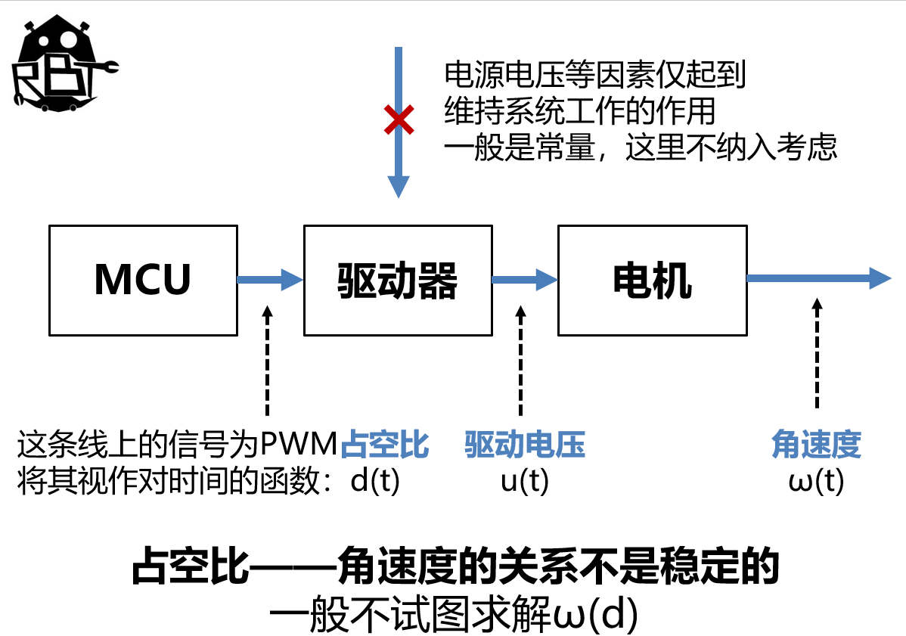
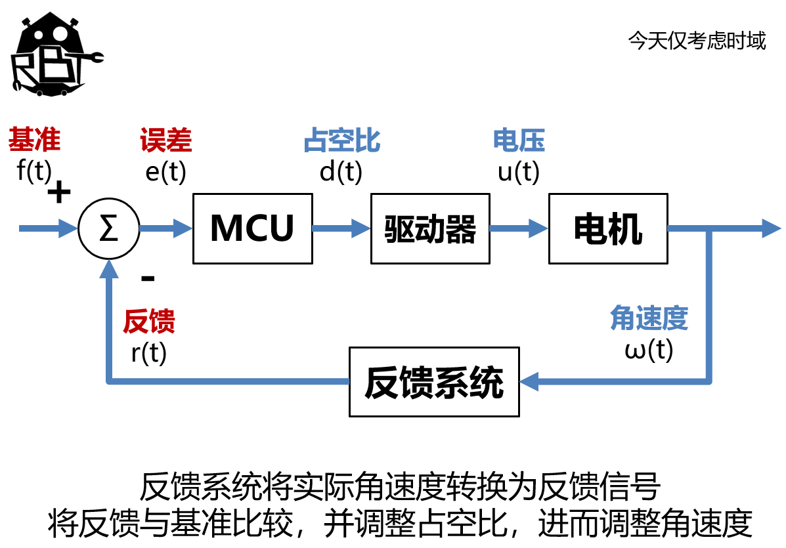
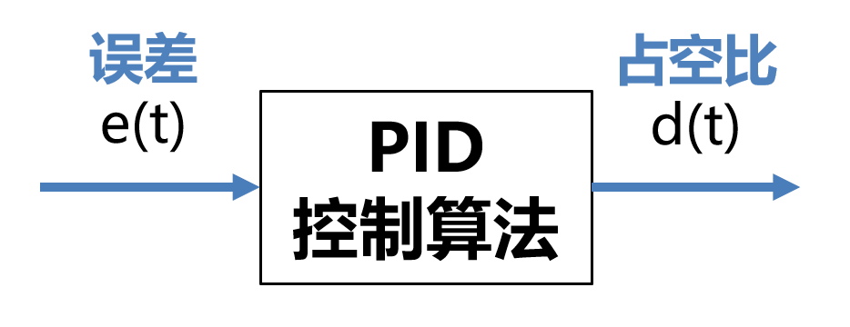
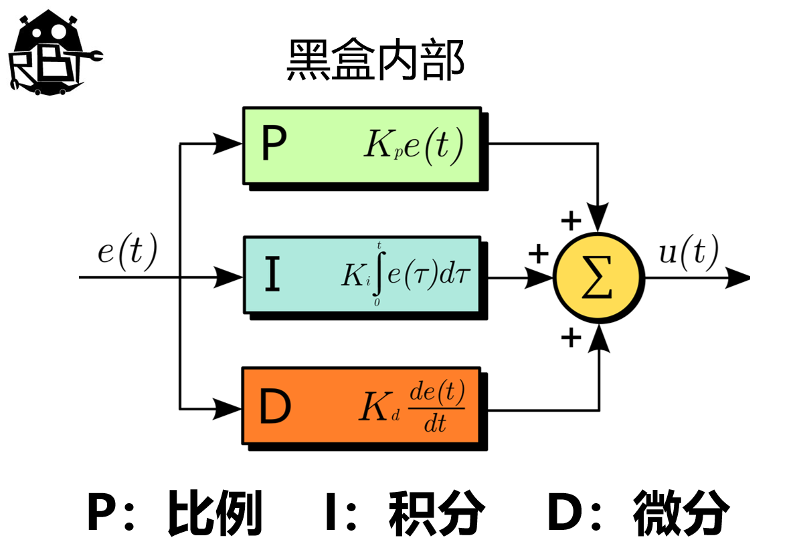

# pid控制入门
---
# Anycar的结构

---

---
# Q:在MCU内部，我们如何将输入的反馈误差转化为输出信号？
**A：利用pid算法**

# Q：为什么不用加权求和？
**A：可能会有震荡等问题，难以迅速达到稳态**

---
# 我们今天关心的

**pid算法：将误差通过一系列计算变成输入，以进行负反馈调节**

---
# 何为pid控制算法？
>PID算法是一种基于比例（P）、积分（I）和微分（D）的控制算法，用于调节系统输出以达到期望值。它通过以下三种方式调整控制量：
比例（P）：根据当前误差的大小调整控制量，误差越大，调整越快，但可能无法完全消除误差。
积分（I）：累加过去的误差，消除稳态误差，确保系统输出最终达到期望值，但可能导致超调或振荡。
微分（D）：预测误差的变化趋势，提前调整控制量，减少超调和振荡，但对噪声敏感。
PID算法通过调整比例系数（Kp）、积分系数（Ki）和微分系数（Kd），综合这三种作用，实现快速、稳定且精确的控制。

---
# Inside the box

