# 春夏学期内训week1

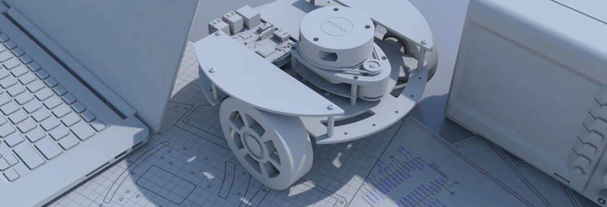

---

# 内训安排
| 时间 | 安排 |
|:---------:|:--------:|
| week1 | 中控杯比赛分享 | 
| week2  | solidworks三维建模基础  | 
| week3 | 3D打印 | 
| week4 | pwm舵机和机械臂组装 | 
| week5  | esp32相机 | 
| week6 | 机械臂调试 | 


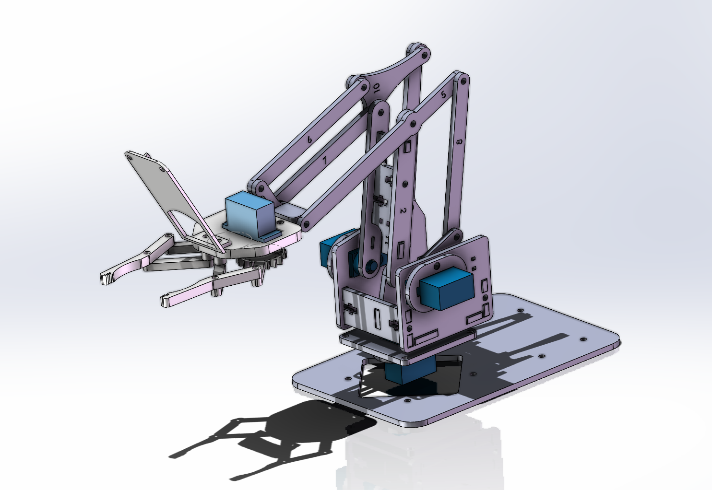

---

# 中控杯比赛分享（对抗赛道）

- PART1 比赛流程
- PART2 规则解读
- PART3 策略构思
- PART4 机器人设计方案分享

---
# 两个问题
**Q1:为什么参加中控杯？**
**Q2:期望从中控杯中收获什么？**

不同的参赛目的可能有不同的投入和预算

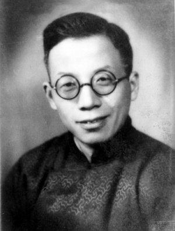

---

# PART1 比赛流程（对抗赛道）

1. 报名、参加培训讲座
2. 校内设计方案评审（**重要！！**）
3. 校内预赛（*形式可能不一样*）
4. 校赛（一等奖可进入省赛）
5. 省赛

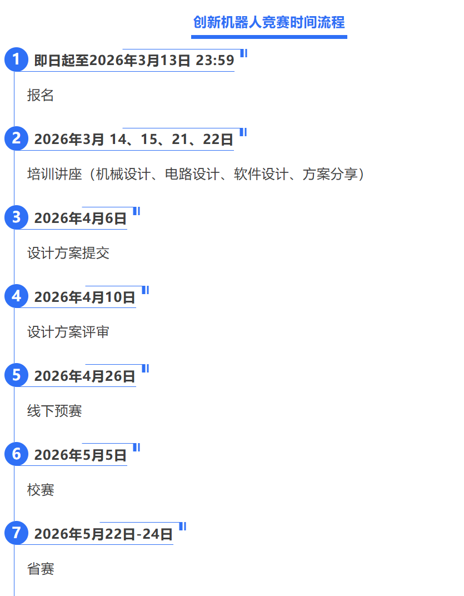

---
# 设计方案评审

- 尽量多写一些，按照要求写！
- 可以多贴一些代码上去~~显得专业~~
- 未必要和最终方案一样，只是一个参考
  
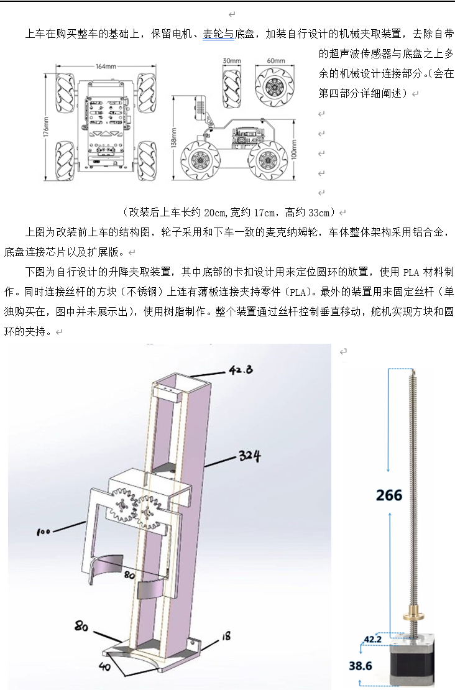


---

# PART2 规则解读

**核心是鼓励钻各种漏洞：（**

---
# 基本规则
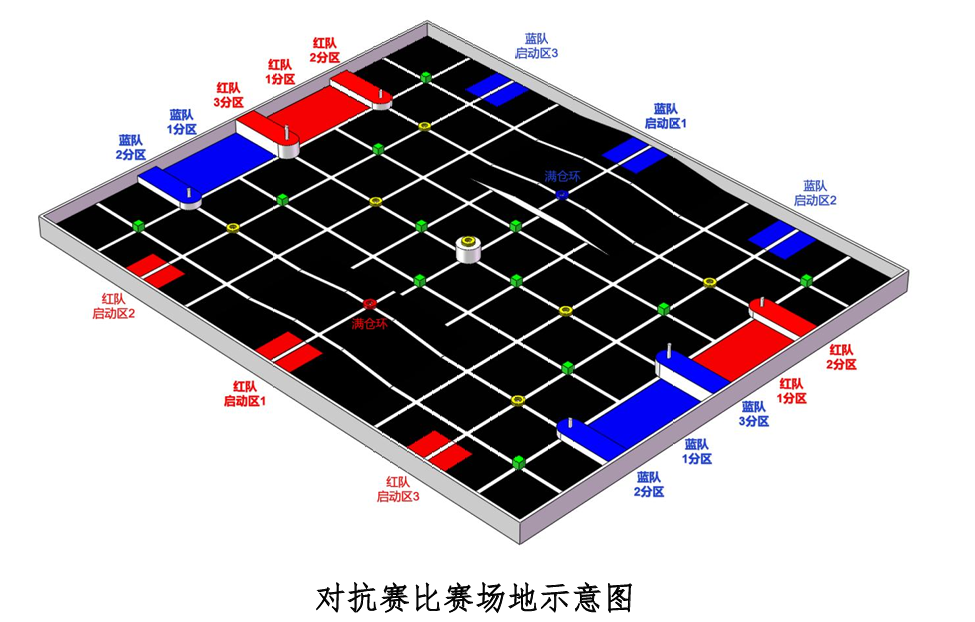

- 绿砖：1分
- 黄环：2分、3分
- 红/蓝环：“满仓环”，使该得分区直接获得所有分值（bonus）

**注意：得分看的是比赛结束的那一刻的分值，并不是拿到了就一定一直拿到了！**


---
# 关于启动和重启
- 三个启动区中任选一个启动
- “以任何方式启动”：手动/红外遥控/蓝牙（不推荐）/光电门/...
  **后几者的好处：可以备多套plan**
- 重启：有两次重启机会；重启时必须所有己方机器人都下场，但是可以只重新上场部分机器人
- 和对方机器人接触时不能重启！也不能去碰，否则做违规处理

---
# 视频：浙大内战

---
# 关于机器人的限制
- 非遥控（至少是非全程遥控）
- 大小必须小于30x30x50cm
- 不能抱着毁坏目的破坏对面人或车
- 可以多辆“车”

>制作一台机器人参加比赛（这里一台指可以完全放入启动区且符合规则3.3比赛尺寸要求的机器人，允许机器人设计能分离的部分，但这些“部分”不能太小，任何部分在完全分离后必须满足：保证此部分可以在之后比赛中被再次使用的情况下，裁判只借助双手的简单操作却无法将其放入一个规格900g的伊利高钙高铁奶粉的空奶粉罐中且盖上盖子。


---

# 举个例子

- 飞镖的故事
- 网兜的故事


---
# 读规则的关键
- 设计时，规则没有禁止的都可以做！
- 比赛时，善用重启非常重要！


---
# PART3 策略构思

**可以围绕这些点队内进行讨论：**

- 采用几辆车的方案
- 哪些分数必须争取，哪些分数可以尝试，哪些分数战略性放弃
- 每辆车负责哪些功能，多车如何配合
- 规则变化的趋势：1分方块的占比越来越少，2分3分占比越来越大

---
# 开环OR闭环？
*此处的开环指的是根据预设路线巡线，并不是完全的开环*
- 不推荐完全开环
- 大部分队伍采用的策略是预设路线的模式，预设线路可以有多条（planA、planB...）
- 可以尝试没有预设线路的方案（难度较高，风险大，但是收益大）


---
# 一段闭环的伪代码

```python
while 比赛没有结束:
    if 探测到方块 and state == searching:
        state = transporting
        move()        ## 运送方块 ##
        state = searching
    else:
        search()


```
---
# 视频：开环现场改代码


---
# PART4 机器人设计方案分享
- 机器人设计架构
- 一些设计方案分享
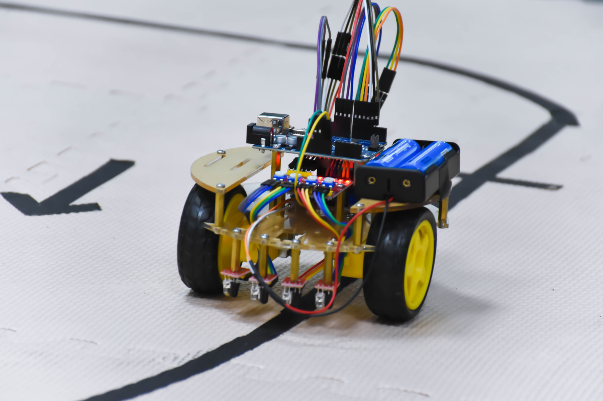

---

# 机器人设计架构

**一种比较推荐的思路是买成品的车来做二次开发！**
- MCU
- 传感器
- 电机
- 电源和供电模块
- 机器人主体
- 机械臂及其他功能模块


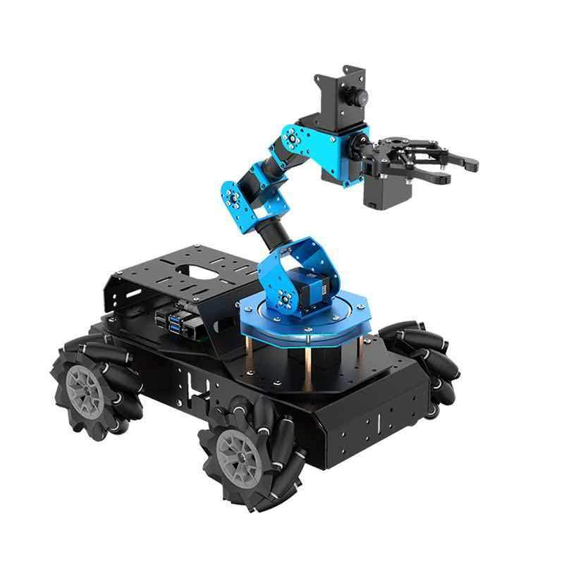

---

# MCU选取
**根据参赛的目标、自身的水平选择合适的MCU！**
- **上位机+下位机的架构** 优点：可以搭载的模块多，上限高；缺点：成本高，学习成本高
推荐树莓派+stm32（参考寒假项目的小车）

- **单独下位机的架构** 优点：方便简单、稳定；缺点：上限低
  推荐Arduino Mega

---
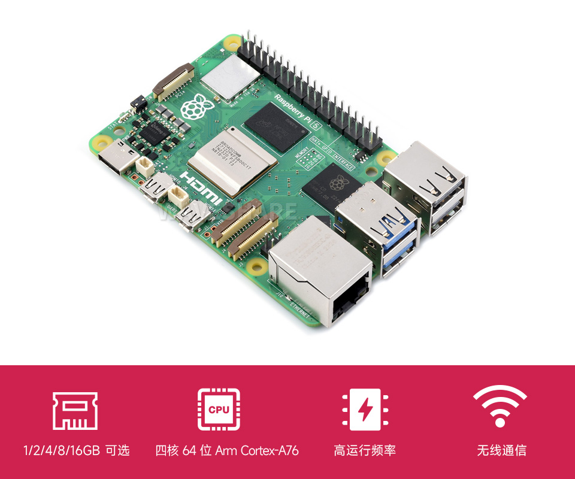
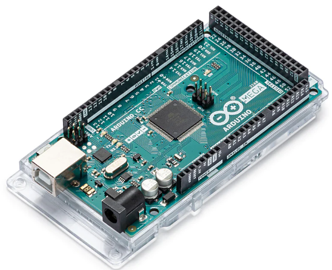


---
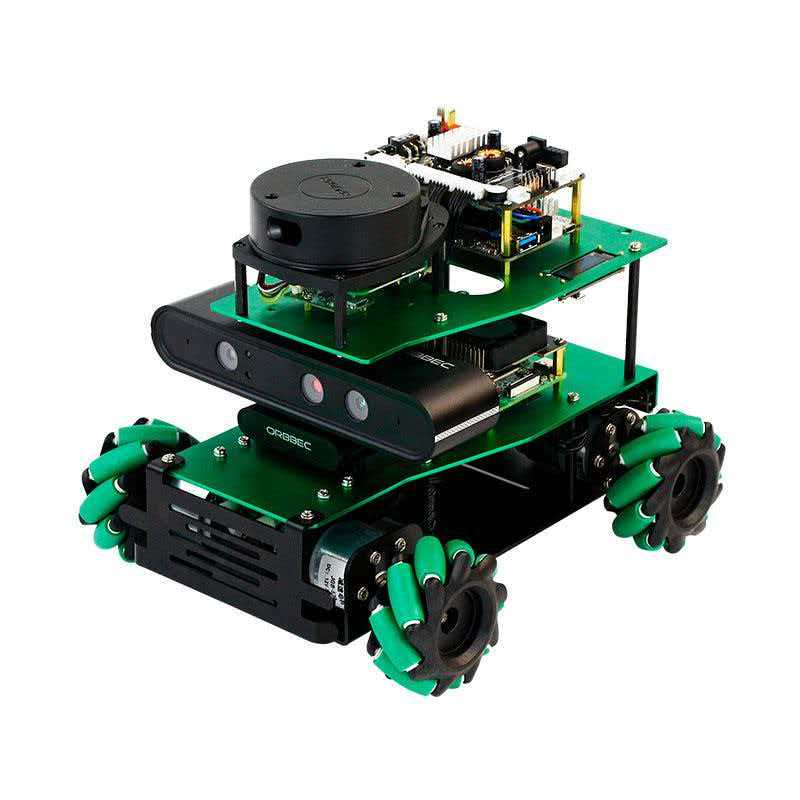


---

# 传感器
- 四路/八路/十六路巡线模块
- 激光雷达
- 相机/深度相机
- 启动模块：红外遥控模块/光电门，*不推荐用开关*
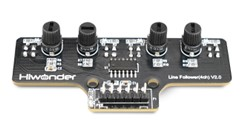  

---
# 再放一遍这张图。。。


---
# 电机
**不管是什么层次的，都建议电机往好了选！**
尽量都至少是编码电机（伺服电机）

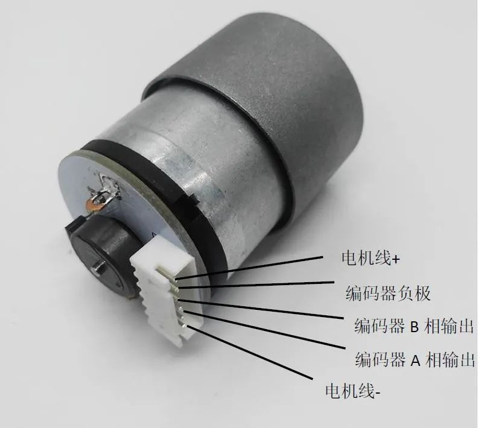

---
# 电源和供电模块
- 推荐使用12v或24v电池
- 如果各模块工作电源不一样，可以买一个降压模块

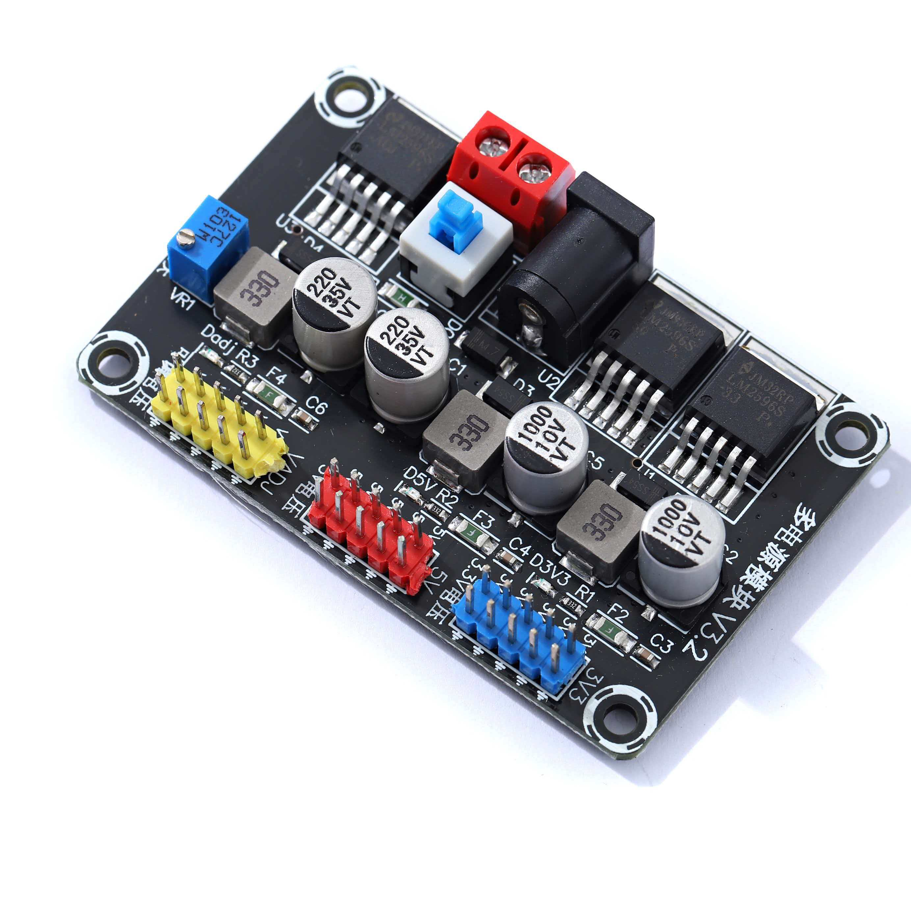

---
# 机器人主体
可以用solidworks等建模软件设计各硬件的连接件；
后续可以通过金加工、亚克力激光切割、3D打印等方式加工

- 推荐使用麦克纳姆轮底盘
**注意：设计要便于打印、加工！**
**在此基础上，最好便于对抗**

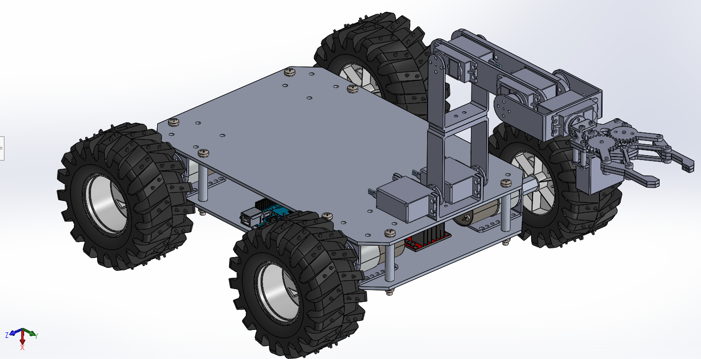

---
# 机械臂及其他功能模块
- 考虑如何抓/推/扔/...方块？
- 最简单的方法：推爪/凹槽
- 进行升降的简单方法：丝杠升降装置
- 较进阶的方法：机械臂（需要舵机）
  ...
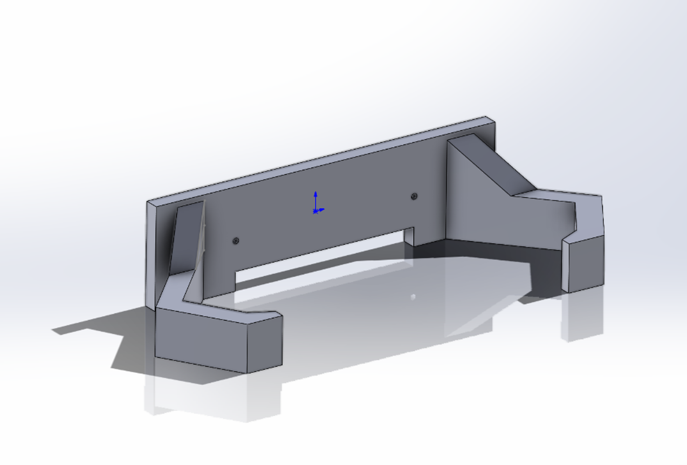

---
# 奇奇怪怪的功能模块
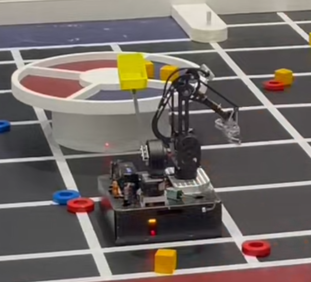
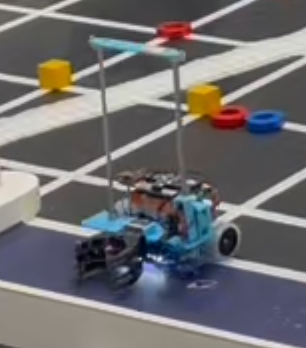

---
# （？）
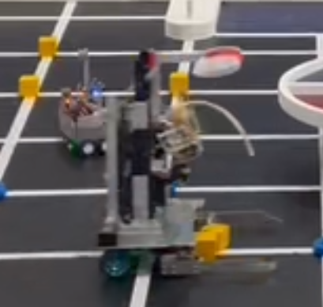


---
# <!---fit--->一些设计方案

---
方案一

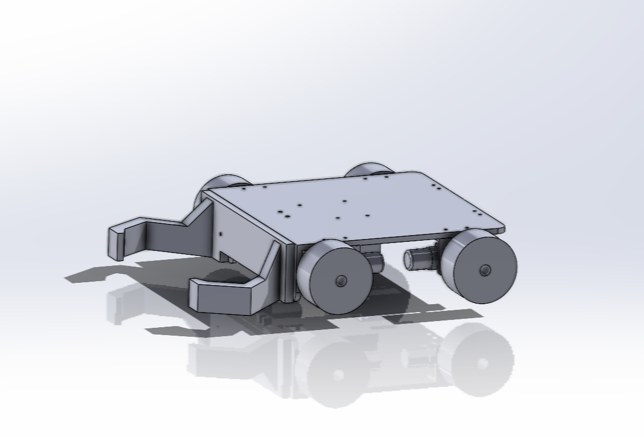
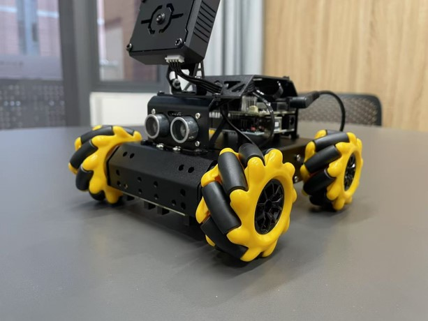


---

# 方案一（本校）
- 上下车结构，下车负责拿一分方块，上车负责干扰
- 两车均用Arduino uno+四路巡线传感器+四个TT马达+7.4v可充电锂电池
- 按照设定路线行进（可结合代码、排位赛视频食用）
---
# 排位赛视频

---

# 方案二（外校）
- 前后车结构，两车均可实现一分、二分
- 靠推爪推一分方块，靠机械臂抓二分圆环
- 按照设定路线行进

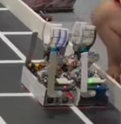

---
# 方案三（冠军方案）
- 只用一辆车，全程不用重启
- 没有固定逻辑，开局上来先放一个三分方块，接着开始找方块、**投**方块的循环
- 造价高昂


---
# 半决赛视频


---

# 机协能提供的资源
- 3D打印及耗材
- 学校报销以外的额外经费(但不多)
- ~~能在月牙楼小屋里淘到的材料~~
- 机协发的队友（
- 机协内部交流和友谊赛


---
# THE END
# Thanks for Your Attention!