# Solidworks三维建模基础

---
# Contents
- ## 三维建模、CAD概念简介
- ## Solidworks上手实例

---
# What is Solidworks（SW）?

- Solidworks 是应用广泛、便于上手（？）的工业建模软件（CAD软件）

- 不同于blender、unity等动画、游戏建模，SW主要用于零件、机械结构的建模

---

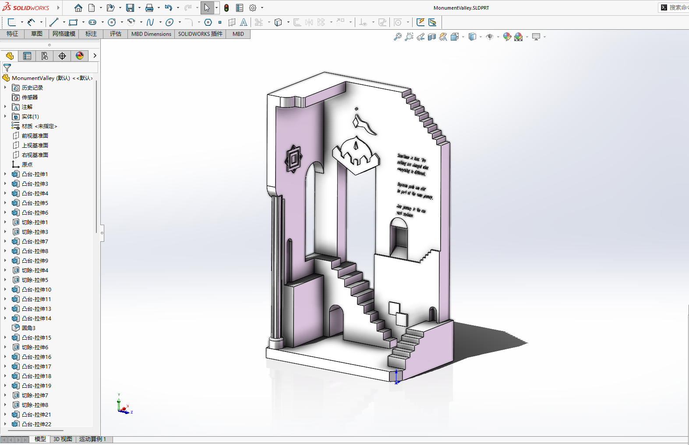

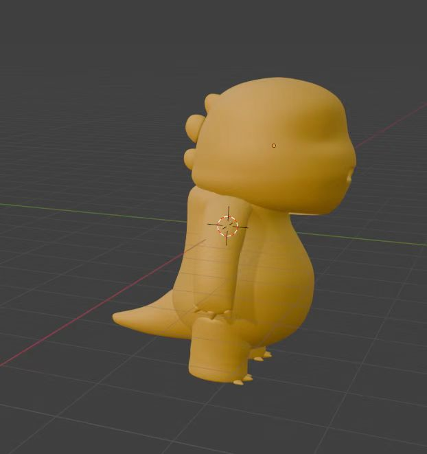

---
# What is CAD?
- Computer-Aided Design, 计算机辅助设计
- CAD的终点通常是**制造**，而非渲染出好看的图片
- 在电子设计中，CAD含义类似——计算机辅助设计（印刷电路板）

---

# 零件设计流程

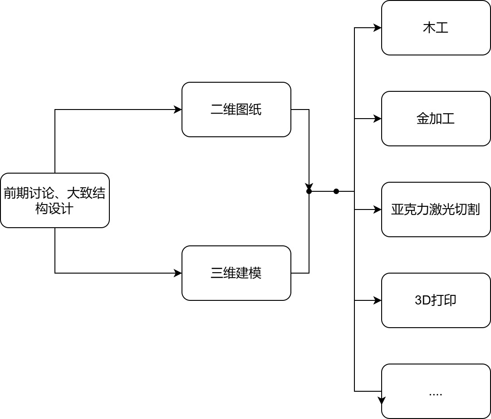

---
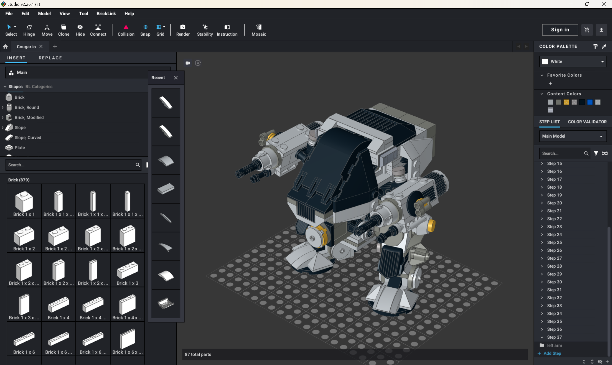

---
# 工业界应用belike:
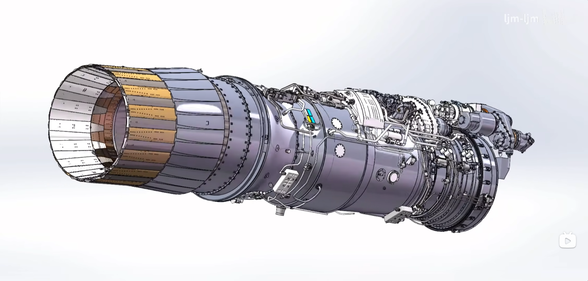

---
# plus:渲染

---

---

---
# How to use Solidworks?<!--fit-->

---

# step1: 下载、安装
软件占用空间大、安装时间长，且一旦安装错误难以完全删除，故安装有一定难度

好在B站上有较多安（po）装(jie)教程，大部分都是靠谱的

**注意安装版本！尽量往新了装，因为可以向下兼容**

---
# 安装成功的界面

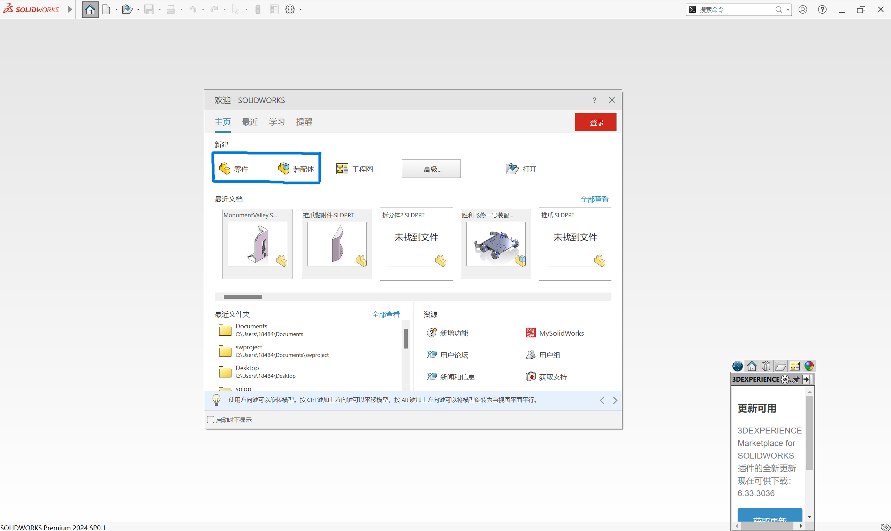

---

# step2:新建零件文件

- 零件文件（SLDPRT文件）：单个零件的建模
- 装配体文件（SLDASM文件）：多零件配合形成的装配体（零件1+零件2+···）
（本质上只是记录各个零件文件配合时的几何位置关系）
**装配体文件需要文件夹中包含所有涉及到的单个零件文件才能正常打开！！**

---

# 接下来是最重要的两步：<!--fit-->
**1.绘制草图  2.编辑特征**

---

# 1.绘制草图
简单来讲就是在一个平面内画出建模对象的二维基本特征（或者说投影）

- 基本步骤：绘制草图基本形状--编辑尺寸--退出草图

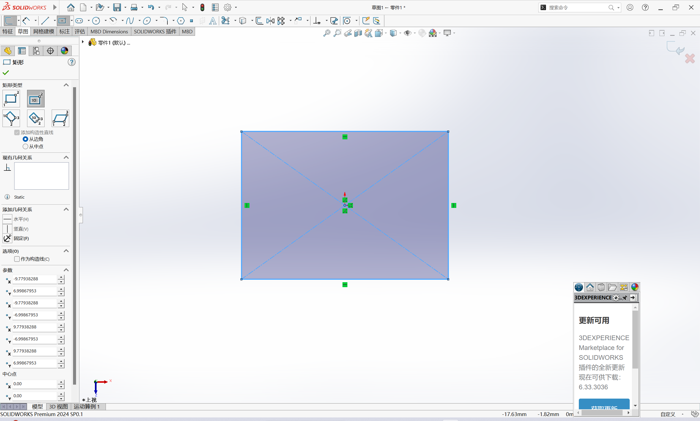

---
# 编辑尺寸
用到草图工具栏中的“智能尺寸标注”选项，输入尺寸数字即可编辑尺寸

不难发现，输入尺寸前所有点均可任意拖动；输入尺寸后则会有所约束
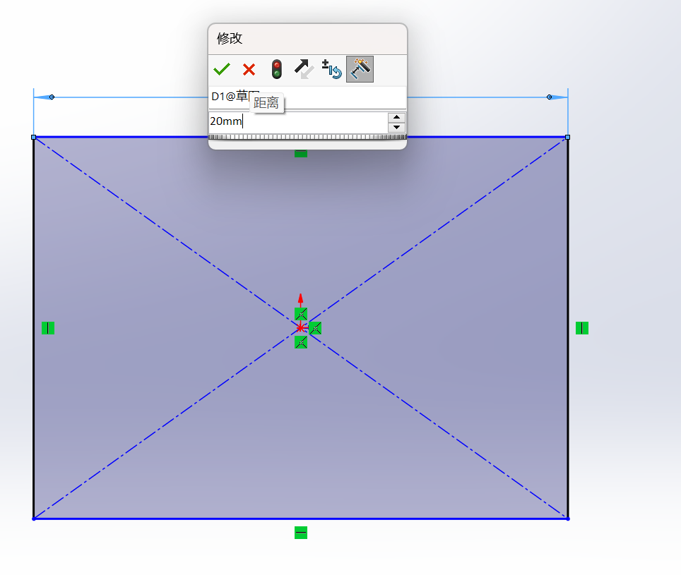

---
# 编辑尺寸-完全定义
>

## 即：完全定义时每个点都有唯一且确定的位置

---
# 完全定义
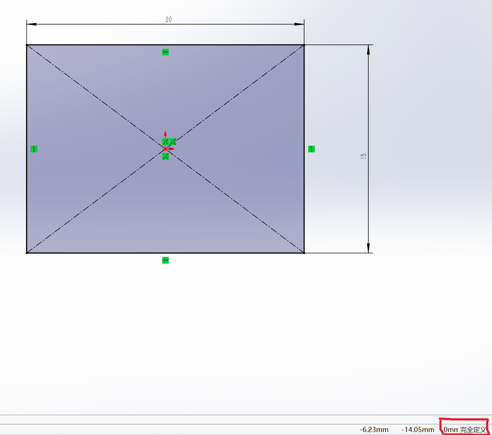

- 可通过添加尺寸约束或添加几何关系来达到【完全定义】
- 但注意不要出现重复或冲突尺寸，此时被称为【过定义】

---
# 退出草图
## 草图绘制完成后，请一定记得点击“退出草图”键或如下图标（右上方）退出草图！！

- 在下一步拉伸过程中发现选项卡是灰色的，大概率是因为没有退出草图！

---
# 记得退出草图！！
# 记得退出草图！！
# 记得退出草图！！<!--fit-->

---
# 2.编辑特征

- 特征是一种基于草图进行的对于三维实体的操作，以构成零件中的某一独立部分，如圆柱、立方体等
- 特征主要有拉伸、拉伸切除、倒角等操作
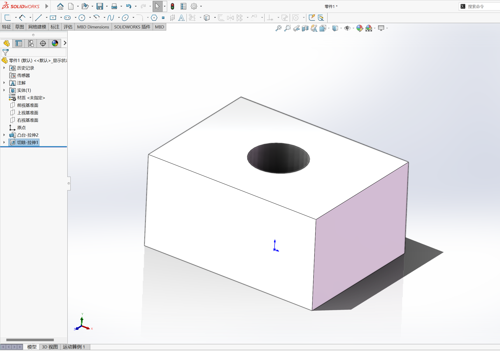

---
# 特征——拉伸
如果你在前一步中正确退出了草图，那么你会发现在选中你绘制的草图后，“特征”那一栏中诸多选项卡是亮起的
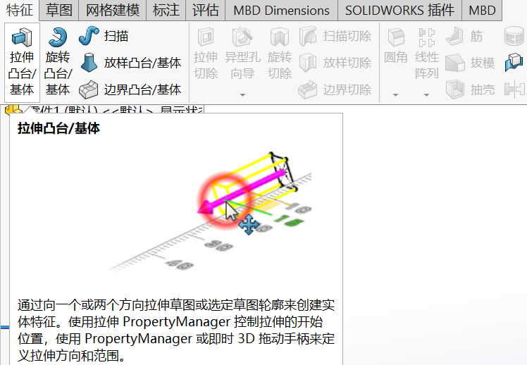

选择第一个“拉伸”选项，在左侧栏设置拉伸长度，就可以得到草图对应的柱体（前提：闭合图形）

---
# 拉伸结果
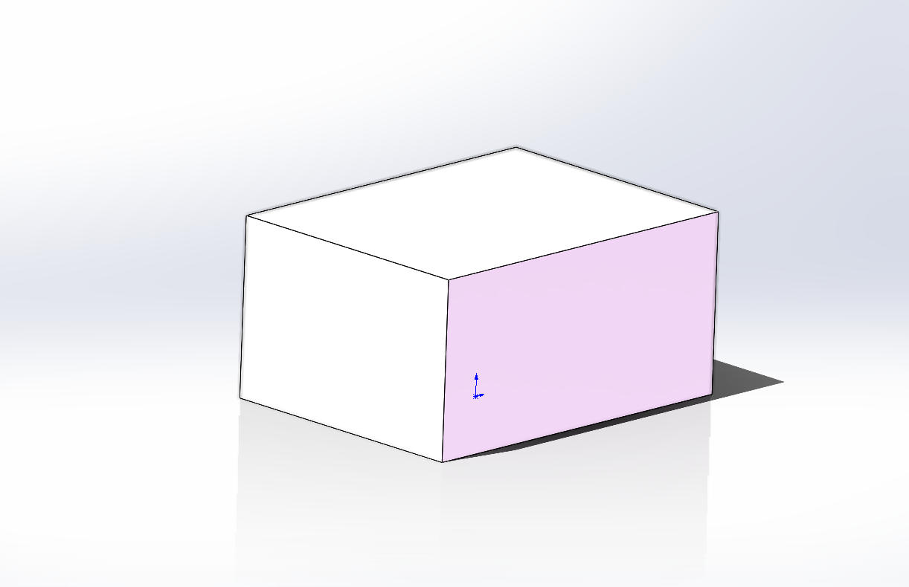

---

同时你会发现，原来绘制好的草图貌似消失了？
## 其实并没有，只是包含在“特征”里面了
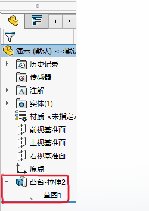

# 所以，一般来说一张草图对应一个特征！

---

# 特征——拉伸切除
- 与拉伸相反，拉伸切除就是切去绘制的草图形状在指定方向上、指定深度的形状
- 拉伸切除与拉伸配合使用，便可得到大多数的形状
- 但首先，你需要新绘制一个草图
  
---
# 如何新建草图
右键选中要绘制草图的平面（一般是已有实体的某一个面，当然你也可以插入一些辅助面），点击“草图绘制”
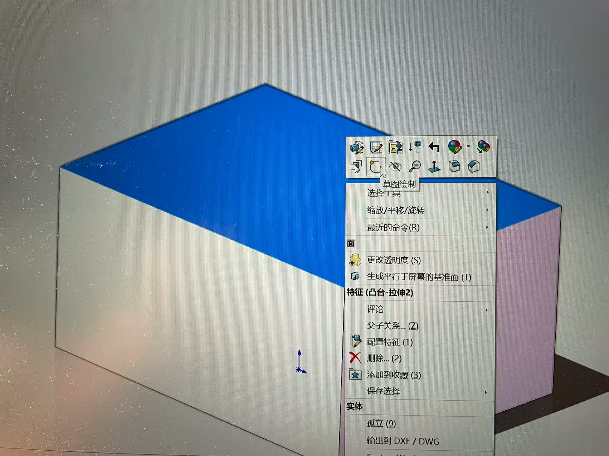

---
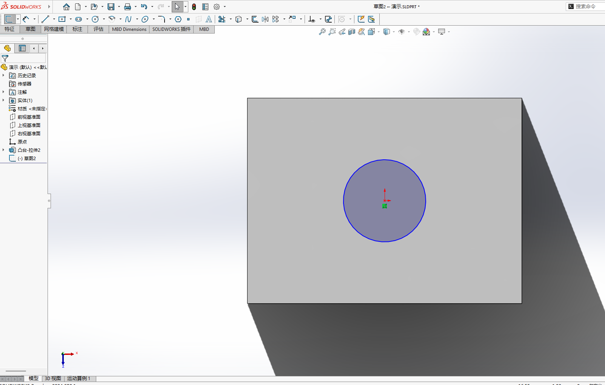

---
# 拉伸切除
绘制草图的步骤同上

绘制完成后，点击“特征”中的拉伸切除，同样需要在左侧栏选择切除深度（或者也可以选择完全贯穿）

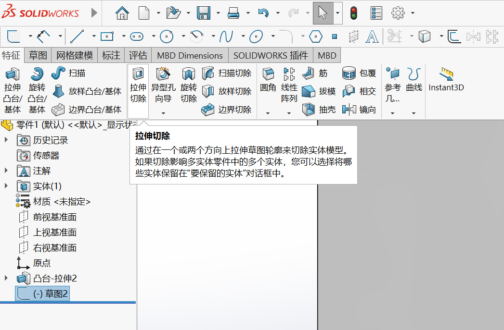

---
# 于是你得到了

---
# 总结
- 零件由诸多特征构成，一个特征由一个草图经过拉伸、旋转、切除等方式得来
- 草图尽量完全定义再使用
- 由草图到特征需要先退出草图

---
## 那么，恭喜你
# 学完了<!--fit-->

---
# 随堂练习（bushi）
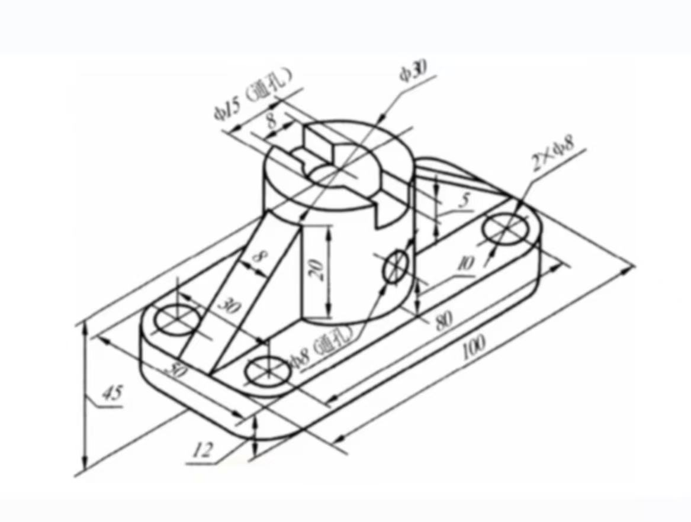

---
# 一些小技巧
- 圆角不建议在草图中画出，可以在特征中选择“圆角”
- 绘制草图或拉伸实体可大胆添加辅助线
- 大部分草图都具有较强对称性，可以使用“镜像”绘制
- 实体绘制草图有时找不好基准面时，可以自己插入一个辅助面

