# PWM舵机调试及机械臂组装

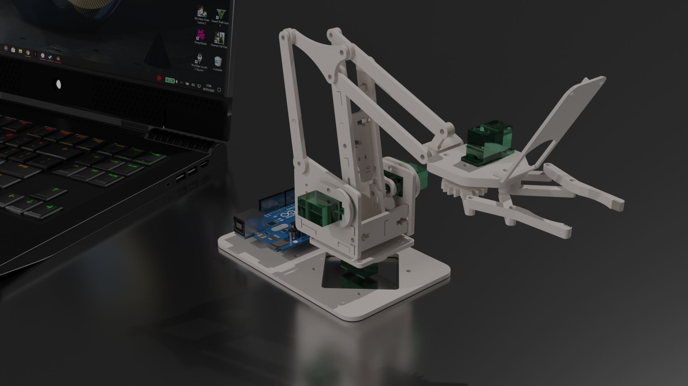

---
# 什么是舵机（Servo）

>舵机(Servo)是在程序的控制下，在一定范围内连续改变输出轴角度并保持的电机系统。即舵机只支持在一定角度内转动，无法像普通直流电机按圈转；其主要控制物体的转动并保持（机器人关节、转向机构）。适用于位置角度经常变化的场合。

- 本质是电机
- 无法像电机一样持续转动
- 一般扭矩大，常用于关节姿态控制

---

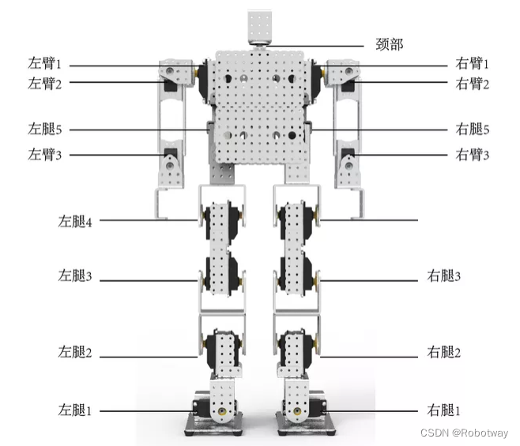

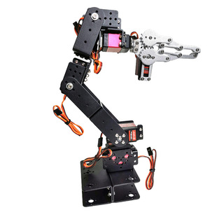

---

# 舵机内部结构

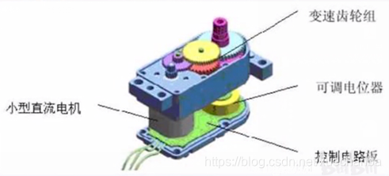

- 变速齿轮组：降低转速，增大扭矩

---
# 舵机关键参数

- 扭矩（kg·cm 或 oz·in）：舵机输出的力矩大小。
- 速度（秒/60°）：舵机转动一定角度所需的时间。
- 电压（V）：舵机的工作电压范围。
- 尺寸（mm）：舵机的长、宽、高。
- 齿轮类型：塑料齿轮、金属齿轮或碳纤维齿轮。
- 重量（g）：舵机的重量。

---
# 舵机分类

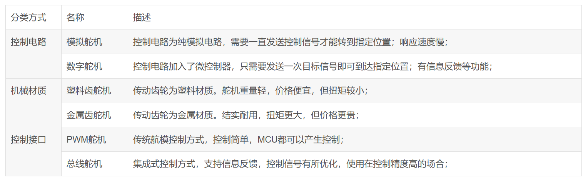

---
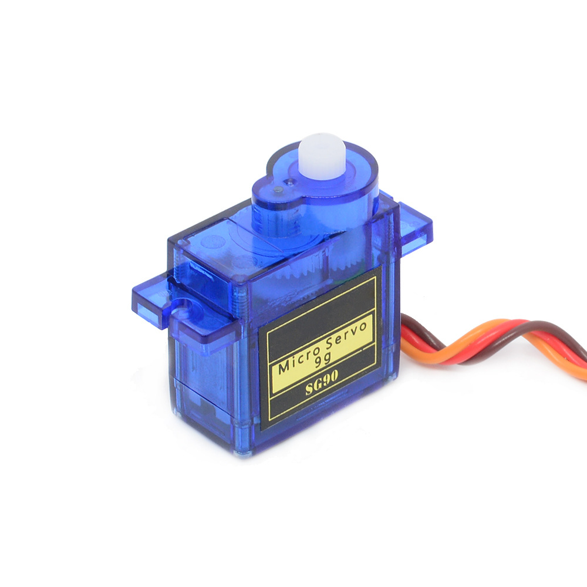

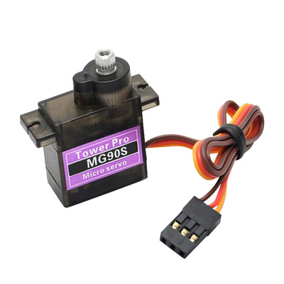

---
# PWM舵机

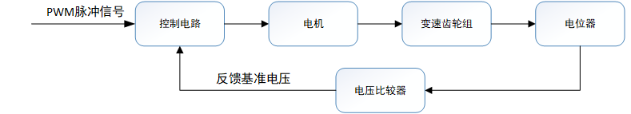

---
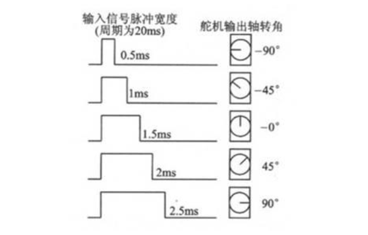

---
# 内训使用的舵机

- PWM舵机
- 大扭矩（造价高昂）

---
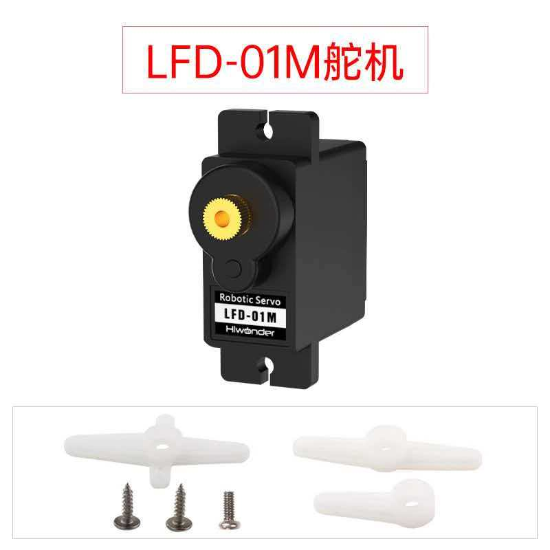

- 防堵转（适用于夹爪）

---
# 舵机接线
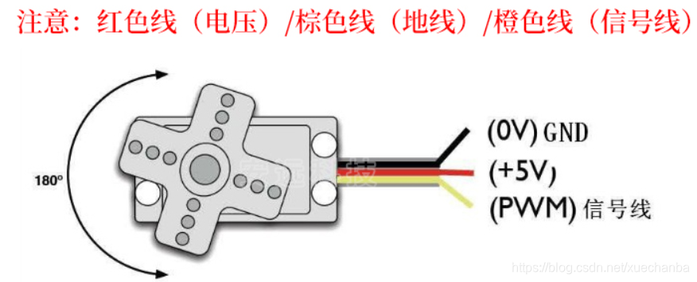

---
# 舵机中立位置（重要！）

>舵机的中立位置指舵机旋转角度为0°的位置

**保证舵机臂在中立位置的正确安装，是舵机正常工作的前提！**

---
举个栗子

---
# 在arduino中用servo库控制舵机

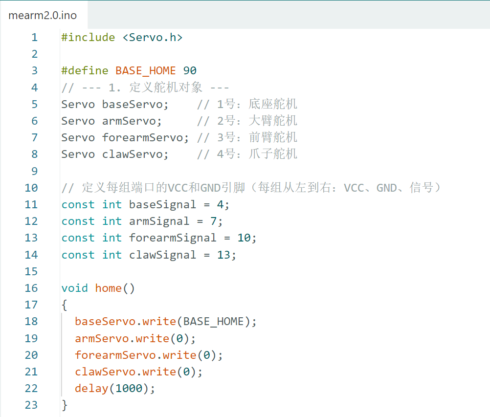

---

# mearm2.0

---
# 发行说明 v1.0.0

- 来源于一个开源项目mearm
- 对基于扫描的solidworks文件进行修改
- 加入更可靠的夹爪；加入相机

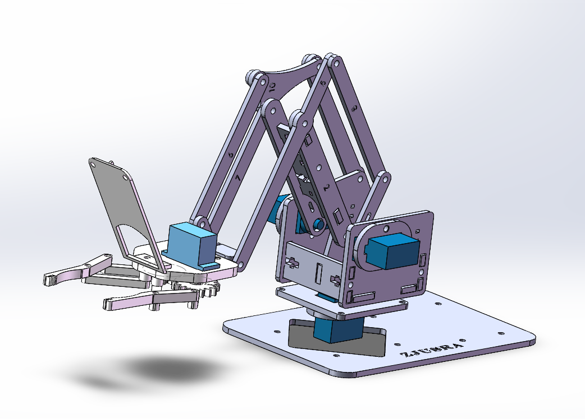

---
# 实践环节：按照说明书拼装

---
# THANKS FOR YOUR ATTENTION!

